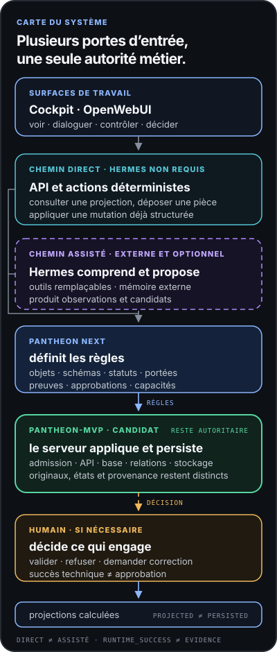

# Pantheon Next

> Référentiel canonique de gouvernance pour le travail professionnel assisté par IA.

[English](README.md) · [Site public](https://ifanjuang.github.io/Pantheon-Next/) · [Statut](docs/governance/STATUS.md) · [Ce qui tourne](docs/governance/WHAT_RUNS.md) · [Index de gouvernance](docs/governance/README.md) · [Contribuer](CONTRIBUTING.md)

Pantheon Next porte la doctrine, les schémas, les statuts et les gates utilisés pour qualifier un travail professionnel conséquent. Il gouverne la provenance, l’Evidence, le périmètre, les approbations, les claims, les ChangeCandidates et les Capability Slots.

Ce n’est pas un runtime d’agent, un scheduler, une queue, un routeur de providers, un installateur, un gestionnaire de plugins, un moteur de mémoire ou un système d’approbation automatique.

## Frontière du système

| Composant | Responsabilité |
|---|---|
| **Pantheon Next** | Gouvernance, doctrine, schémas, statuts et frontières d’autorisation. |
| **[pantheon-mvp](https://github.com/ifanjuang/pantheon-mvp)** | Implémentation candidate externe : PostgreSQL, APIs, projections Cockpit et adapters. |
| **Hermes** | Exécution externe des tâches, skills, tools et bindings runtime. |
| **Cockpit / OpenWebUI** | Interaction utilisateur et projections de décision. Le statut UI n’est pas une autorisation. |
| **Humain** | Revue, approbation, refus et signature des décisions conséquentes. |

```text
Pantheon gouverne.
Les runtimes externes exécutent.
L’humain décide ce qui engage.
```



Le chemin direct ne requiert pas Hermes. Le chemin assisté produit des observations ou des candidats ; il ne les approuve pas. La [landing page publique](https://ifanjuang.github.io/Pantheon-Next/) présente aussi la chaîne d’autorité et la carte d’honnêteté sur l’état réel.

## État du dépôt

Pantheon Next est canonique mais encore partiel. Le dépôt contient la doctrine de gouvernance, des schémas déclaratifs, des tests de validation, une documentation statique et une surface bornée read-only de politique et de vérification.

Avant de retenir une affirmation d’implémentation, lire :

1. [`STATUS.md`](docs/governance/STATUS.md) — posture actuelle et exceptions actives.
2. [`WHAT_RUNS.md`](docs/governance/WHAT_RUNS.md) — ce qui tourne, ce qui est statique, partiel ou absent.
3. [`AUTHORITY_INDEX.md`](docs/governance/AUTHORITY_INDEX.md) — classes d’autorité et règles de promotion.
4. [`MODULES.md`](docs/governance/MODULES.md) — propriétaires et frontières runtime par domaine.

## Développement

La racine est un workspace de gouvernance et de documentation. Elle n’est volontairement **pas** une distribution Python installable.

```bash
python3 -m venv .venv
source .venv/bin/activate
python -m pip install -r requirements-dev.txt
python -m pytest -q
```

`mcp-server/` est la seule distribution Python maintenue dans ce dépôt :

```bash
python -m pip install "mcp-server/.[test]"
python -m unittest discover -s mcp-server/tests -v
```

`VERSION` est la version de checkpoint du dépôt. `CHANGELOG.md`, les métadonnées du paquet et les tags de release doivent rester alignés.

## Carte du dépôt

| Chemin | Rôle |
|---|---|
| [`docs/governance/`](docs/governance/) | Doctrine canonique, autorité, statuts et frontières. |
| [`schemas/`](schemas/) | Contrats structurels gouvernés. |
| [`tests/`](tests/) | Tests de validation et de cohérence du dépôt. |
| [`mcp-server/`](mcp-server/) | Projections read-only de politique et de vérification. |
| [`hermes/profiles/`](hermes/profiles/) | Templates candidats de profils Hermes ; aucun runtime installé. |
| [`docs/assets/`](docs/assets/) | Pages et prototypes statiques ; pas une disponibilité produit. |
| [`ai_logs/`](ai_logs/) | Trace d’intervention ; pas de doctrine. |

## Règles de contribution

Avant tout travail significatif, lire les documents actifs et les PR ouvertes. Le dépôt l’emporte sur les anciens prompts et les plans historiques.

Parcours minimal :

```text
docs/governance/STATUS.md
docs/governance/WHAT_RUNS.md
docs/governance/AUTHORITY_INDEX.md
docs/governance/MODULES.md
docs/governance/README.md
CONTRIBUTING.md
```

Les modifications des schémas, tests, CI, fichiers Docker, opérations, plateforme ou de `mcp-server/` exigent une revue protégée. Un candidat ne devient autoritatif qu’après promotion explicite avec un schéma, un test, une observation vérifiée ou une décision humaine datée comme référent.

## Invariants

```text
installed != approved
healthy != safe
runtime_success != Evidence
retrieved != truth
binding_selected != dependency_adopted
activated != task_authorized
UI status != authorization
```

## Licence

MIT — voir [`LICENSE`](LICENSE).

Copyright © 2026 IFJ Architecture.
