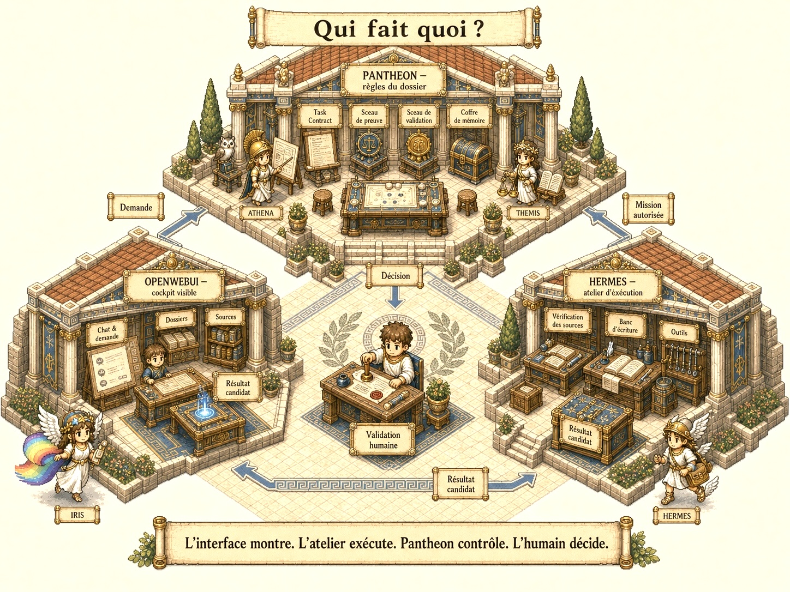
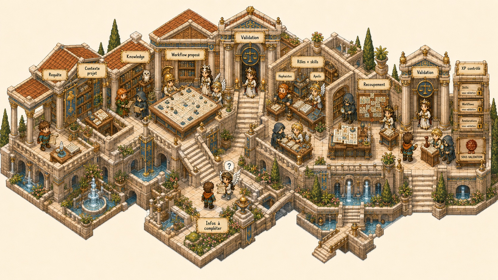
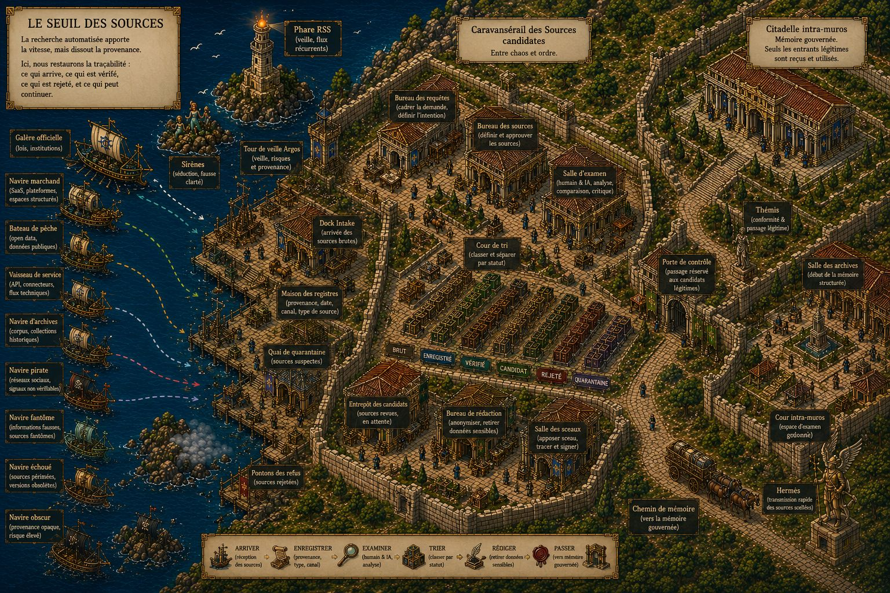
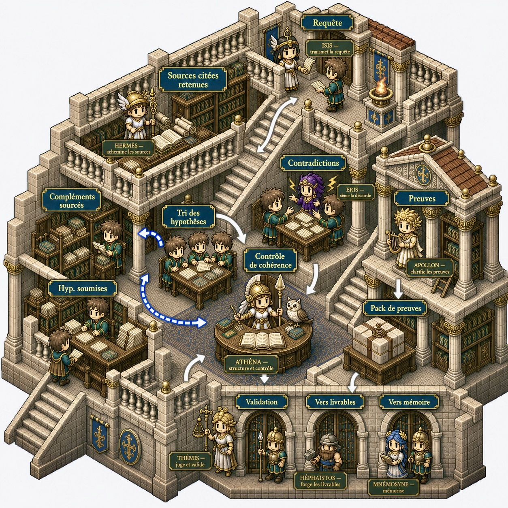
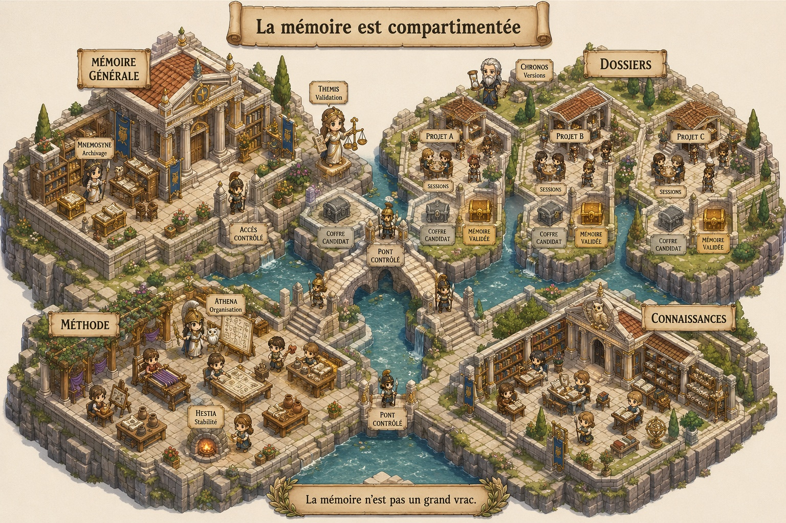
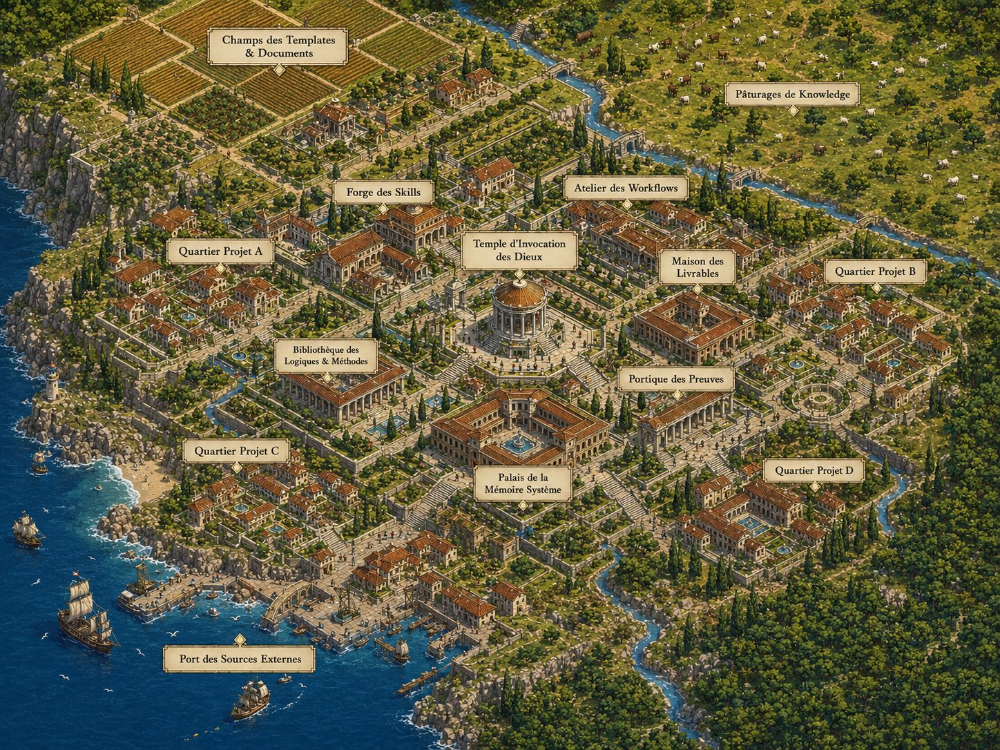
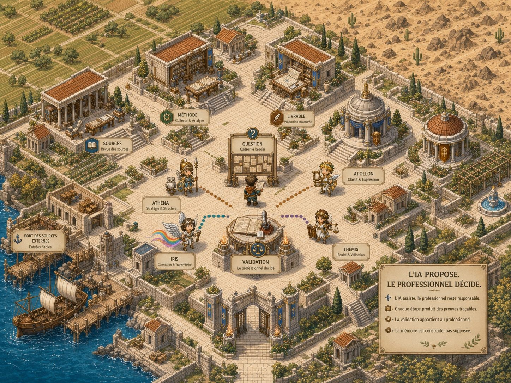
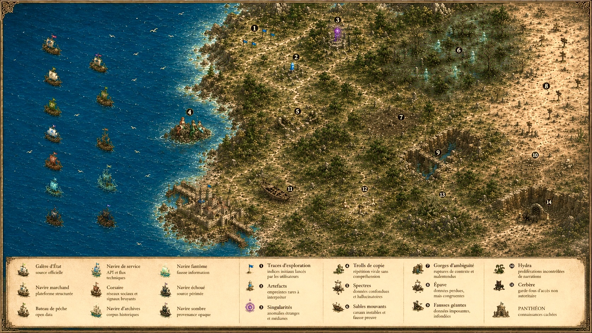

# Pantheon Next

> English version: [README.md](README.md)

> **L’IA ouvre les possibles. Pantheon les organise. L’humain décide. Le validé reste.**

<sub><strong>État actuel :</strong> Pantheon Next est un repository de gouvernance et de documentation en bootstrap contrôlé. Il est cohérent, mais partiel. Pour l’état d’implémentation faisant foi, lire <a href="docs/governance/STATUS.md">docs/governance/STATUS.md</a>.</sub>

Pantheon Next aide les professionnels à utiliser l’IA sur des dossiers sérieux sans perdre la maîtrise des sources, des hypothèses, des preuves, des livrables, de la mémoire et de la validation.

Pour les métiers libéraux, on peut le comprendre comme un **registre de déontologie et de méthode de travail pour l’IA**. Avant qu’une IA reçoive une demande et produise une réponse, Pantheon fixe le cadre : quelles informations peuvent être utilisées, ce qui doit être vérifié, ce qui doit être sourcé, ce qui demande validation et ce qui peut être conservé.

Ce n’est pas une nouvelle stack d’agents autonomes. C’est une méthode professionnelle pour garder le travail IA cadré, traçable et relisible.

En façade, les trois parties sont simples :

```text
L’écran montre.
L’atelier prépare.
Pantheon cadre la méthode.
L’humain décide.
```

La doctrine interne reste :

```text
OpenWebUI expose.
Hermes Agent exécute.
Pantheon Next gouverne.
```

## De l’IA brute au dossier maîtrisé

<p align="center">
  <a href="docs/assets/pantheon-rpg/references/before_after_01_fr.jpg">
    
  </a>
</p>

L’IA seule peut répondre vite. C’est utile, mais insuffisant pour un travail qui engage une responsabilité.

Pantheon cadre la demande, sépare les sources des preuves, rend l’incertitude visible, conserve les contradictions et laisse la validation au professionnel.

```text
Utiliser l’IA plus vite sans perdre la méthode du dossier.
```

## Qui fait quoi ?

<p align="center">
  <a href="docs/assets/pantheon-rpg/references/ui_hermes_pantheon_01_fr.jpg">
    
  </a>
</p>

Pour un lecteur non technique, Pantheon Next se comprend en trois parties :

| Vue simple | Nom technique | Ce que ça veut dire |
|---|---|---|
| **L’écran** | OpenWebUI | L’application de chat IA locale et open source où le professionnel pose sa question, choisit ses documents, voit les sources et valide. |
| **L’atelier** | Hermes Agent | Le travailleur qui peut chercher, extraire, comparer, convertir, rédiger et préparer des sorties candidates dans une mission limitée. |
| **La méthode** | Pantheon Next | Les règles de travail : ce qui peut être utilisé, ce qui doit être vérifié, ce qui demande une preuve, ce qui demande validation et ce qui peut être gardé. |

Une réponse visible n’est pas automatiquement vraie. Une tâche terminée n’est pas automatiquement approuvée. Une sortie utile n’est pas automatiquement une mémoire.

## Où tourne le modèle IA ?

Pantheon n’impose pas une seule stratégie de modèle.

Une équipe peut utiliser des services IA externes comme ChatGPT, Claude ou Gemini lorsque le dossier le permet. Dans ce cas, Pantheon sert à réduire l’exposition avant que quelque chose ne sorte de l’environnement contrôlé : noms privés, adresses de projet, références client, identifiants contractuels ou extraits sensibles peuvent être remplacés, minimisés ou brouillés. La réponse reçue reste un candidat.

Une équipe peut aussi utiliser un modèle local. Dans ce cas, le modèle tourne dans un environnement maîtrisé : par exemple sur un poste équipé d’un GPU, sur une machine locale dédiée, ou sur un NAS/serveur isolé avec Docker. Cette option garde davantage de données dans l’infrastructure du cabinet, mais demande du matériel, de la maintenance et une discipline d’exploitation.

Dans les deux cas, la règle reste la même :

```text
Le modèle propose.
Pantheon cadre la méthode.
Le professionnel valide.
```

## Le chemin professionnel

<p align="center">
  <a href="docs/assets/pantheon-rpg/references/player_journey_01_fr.jpg">
    
  </a>
</p>

Le joueur est l’utilisateur professionnel. Il apporte la question, le dossier, les contraintes, l’expertise et le jugement final.

Pantheon transforme une demande IA vague en chemin professionnel contrôlé :

```text
Demande utilisateur
→ fiche de mission
→ entrée des sources
→ sélection du périmètre et du contexte
→ stratégie de travail
→ exécution externe
→ dossier de preuve
→ livrable candidat
→ revue humaine
→ sortie approuvée, sortie rejetée ou proposition mémoire
→ mémoire validée uniquement après approbation
```

L’IA peut faire plus de travail entre les portes de validation, mais elle ne doit jamais franchir ces portes silencieusement.

## Une source n’est pas une preuve

<p align="center">
  <a href="docs/assets/pantheon-rpg/references/port_01_fr.jpg">
    
  </a>
</p>

Le port représente les flux externes : web, emails, fichiers, API, messageries, dossiers locaux et connecteurs.

Pantheon définit ce qui peut entrer dans le dossier, ce qui reste temporaire, ce qui doit être rejeté et ce qui peut devenir preuve.

```text
Source trouvée ≠ preuve.
Document récupéré ≠ vérité.
Bibliothèque documentaire ≠ mémoire.
Réponse utile ≠ validation.
```

## La preuve avant la confiance

<p align="center">
  <a href="docs/assets/pantheon-rpg/references/evidence_01_fr.jpg">
    
  </a>
</p>

Un dossier professionnel demande plus que des citations. Il demande des appuis relisibles.

Pantheon garde visibles :

| Élément | Pourquoi c’est important |
|---|---|
| Sources utilisées | L’utilisateur peut vérifier d’où vient la réponse. |
| Hypothèses | Le système ne cache pas ce qui reste supposé. |
| Contradictions | Les conflits restent visibles au lieu d’être lissés. |
| Informations manquantes | Le système peut s’arrêter et demander ce qui manque. |
| État de preuve | Une source ne devient preuve qu’après revue. |
| État de validation | Le professionnel décide ce qui peut être utilisé, transmis ou conservé. |

La preuve soutient la revue. Elle ne s’approuve pas elle-même.

## Du résultat candidat au livrable professionnel

<p align="center">
  <a href="docs/assets/pantheon-rpg/references/livrables_01_fr.jpg">
    
  </a>
</p>

Pantheon ne sert pas seulement à répondre à une question. Le but est de produire quelque chose d’exploitable : une note, un tableau, un courrier, une synthèse, un schéma, un rapport, une checklist ou un dossier d’export.

Un livrable reste candidat tant que la revue et le chemin d’approbation nécessaires ne sont pas terminés.

```text
Brouillon ≠ livrable.
Livrable candidat ≠ sortie validée.
Sortie validée ≠ mémoire.
```

## La mémoire reste compartimentée

<p align="center">
  <a href="docs/assets/pantheon-rpg/references/memory_compartment_01_fr.jpg">
    
  </a>
</p>

Pantheon n’utilise pas un grand seau de vérité unique.

```text
Raw Source       matière disponible
Knowledge        information de référence organisée
Context          information bornée à la tâche
Evidence         support sélectionné pour une affirmation ou une sortie
Memory Candidate information durable proposée
Canonical Memory mémoire approuvée, bornée et reliée aux preuves
Doctrine         couche de règles
Runtime State    état d’exécution externe, jamais mémoire canonique
```

La mémoire ne se promeut pas seule. Une sortie utile reste candidate jusqu’à ce que revue, preuve, périmètre et validation rendent sa conservation légitime.

## La ville du dossier maîtrisé

<p align="center">
  <a href="docs/assets/pantheon-rpg/references/citadel_01_fr.jpg">
    
  </a>
</p>

La citadelle représente le dossier professionnel sous contrôle.

Les sources passent par des portes contrôlées. Les hypothèses restent visibles. Les sessions, les versions, les preuves et la mémoire restent bornées. Le professionnel décide ce qui demeure.

## Une méthode autour de la stack IA

<p align="center">
  <a href="docs/assets/pantheon-rpg/references/pantheon_system_summary_01_fr.jpg">
    
  </a>
</p>

Pantheon ne remplace pas l’écran ou l’atelier. Il rend leur configuration, leurs sorties, la discipline de preuve, les seuils de validation et la mémoire de décision relisibles.

C’est la différence entre une stack IA puissante et une méthode de travail professionnelle.

## Le monde extérieur reste ouvert

<p align="center">
  <a href="docs/assets/pantheon-rpg/references/worldmap_ai_internet_01_fr.jpg">
    
  </a>
</p>

L’IA, le web et les connaissances externes forment des mondes riches mais instables. Connaissances utiles, sources faibles, informations obsolètes, contradictions et découvertes inattendues coexistent.

Pantheon ne ferme pas ce monde. Il donne au professionnel une méthode pour le traverser sans confondre signal, source, preuve et mémoire.

## Ce que Pantheon n’est pas

Pantheon Next n’est pas un chatbot, pas un travailleur IA autonome, pas une mémoire automatique et pas un substitut à la responsabilité professionnelle.

Il ne décide pas seul. Il n’approuve pas ses propres sorties. Il ne transforme pas chaque réponse en vérité.

La frontière technique est :

```text
Pantheon Next cadre et contrôle l’exécution.
Il ne l’exécute pas.
```

## Objets de travail clés

| Objet | Sens ordinaire |
|---|---|
| Task Contract | Une fiche de mission : quoi faire, avec quels documents, sous quelles limites et avec quelle sortie attendue. |
| Evidence Pack | Un dossier de preuve : sources utilisées, hypothèses, risques, contradictions, actions et état de revue. |
| Memory Candidate | Une information qui pourrait être utile plus tard, mais qui doit encore être revue avant d’être gardée. |
| Canonical Memory | Une mémoire validée, bornée et reliée à des preuves. |
| Context Pack | Le minimum de contexte utile envoyé à un travailleur pour une tâche donnée. |
| Pantheon Role | Un angle de revue : planifier, vérifier, contrôler le risque, améliorer la formulation, arbitrer ou préparer un patch. |
| Knowledge Base | Une bibliothèque documentaire. Elle aide à retrouver l’information, mais elle n’est pas une vérité en soi. |
| Approval | Une décision professionnelle visible, pas un clic technique caché dans le système. |

## Rôles Pantheon

Le fichier [`docs/governance/AGENTS.md`](docs/governance/AGENTS.md) conserve son nom historique, mais le concept canonique est **Pantheon Role**.

Les rôles sont des points de vue de revue. Ce ne sont pas des agents autonomes.

| Rôle | Fonction simple |
|---|---|
| ATHENA | Organise le problème et prépare le plan. |
| ARGOS | Cherche les sources et vérifie la traçabilité. |
| THEMIS | Vérifie le risque, les règles et les limites d’approbation. |
| APOLLO | Relit la clarté, la complétude et la qualité de livraison. |
| ZEUS | Arbitre lorsque plusieurs options entrent en conflit. |
| IRIS | Reformule, clarifie et prépare la communication côté utilisateur. |
| HEPHAISTOS | Prépare les builds, patch candidates et implementation candidates. |

Les profils Hermes peuvent s’aligner sur ces rôles, mais ils restent des profils d’exécution candidate-only. Ils n’approuvent pas, ne canonisent pas et ne promeuvent pas la mémoire.

<details>
<summary>État et structure du repository</summary>

Pantheon Next fournit aujourd’hui une base de gouvernance documentaire.

Implémenté ou documenté :

- doctrine de gouvernance ;
- doctrine de frontière runtime ;
- registre des Pantheon Roles ;
- doctrine des Task Contracts ;
- doctrine des Evidence Packs ;
- doctrine des approvals ;
- doctrine mémoire ;
- politique des outils externes ;
- doctrine d’intégration OpenWebUI ;
- doctrine d’intégration Hermes ;
- taxonomie des connaissances et cadrage des scopes ;
- assets narratifs et visuels ;
- templates légers de profils Hermes.

Non implémenté dans ce repository :

- runtime autonome ;
- intégration runtime OpenWebUI ;
- intégration runtime Hermes ;
- génération automatique d’Evidence Packs ;
- interface de revue des Memory Candidates ;
- provider routing ;
- plugin management ;
- réconciliation des schemas ;
- tests ;
- outillage read-only operations ;
- stack de déploiement.

Structure :

```text
docs/governance/     doctrine de gouvernance et documents de statut
hermes/profiles/     templates légers de profils Hermes candidate-only
docs/assets/         références narratives et visuelles
ai_logs/             historique des interventions assistées par IA
legacy/              source historique Pantheon OS
schemas/             contrats déclaratifs attendus, non réconciliés
operations/          outillage read-only attendu, non implémenté
tests/               tests attendus, non implémentés
```

Points d’entrée principaux :

| Document | Fonction |
|---|---|
| [`docs/governance/STATUS.md`](docs/governance/STATUS.md) | État faisant foi du repository. |
| [`docs/governance/README.md`](docs/governance/README.md) | Index de gouvernance et ordre de lecture. |
| [`docs/governance/ARCHITECTURE.md`](docs/governance/ARCHITECTURE.md) | Anatomie de gouvernance et modèle de frontière. |
| [`docs/governance/AGENTS.md`](docs/governance/AGENTS.md) | Registre canonique des Pantheon Roles. |
| [`docs/governance/TASK_CONTRACTS.md`](docs/governance/TASK_CONTRACTS.md) | Doctrine de cadrage des tâches. |
| [`docs/governance/EVIDENCE_PACK.md`](docs/governance/EVIDENCE_PACK.md) | Doctrine de preuve. |
| [`docs/governance/MEMORY.md`](docs/governance/MEMORY.md) | Doctrine de promotion mémoire. |
| [`docs/governance/APPROVALS.md`](docs/governance/APPROVALS.md) | Niveaux d’approbation. |
| [`docs/governance/HERMES_INTEGRATION.md`](docs/governance/HERMES_INTEGRATION.md) | Doctrine de frontière Hermes. |
| [`docs/governance/OPENWEBUI_INTEGRATION.md`](docs/governance/OPENWEBUI_INTEGRATION.md) | Doctrine de frontière OpenWebUI. |
| [`docs/governance/EXTERNAL_TOOLS_POLICY.md`](docs/governance/EXTERNAL_TOOLS_POLICY.md) | Gouvernance des capacités externes. |
| [`docs/governance/KNOWLEDGE_TAXONOMY.md`](docs/governance/KNOWLEDGE_TAXONOMY.md) | Vocabulaire source, connaissance, contexte, preuve et mémoire. |

Lorsque des documents se contredisent, traiter `STATUS.md` comme première référence de statut jusqu’à réconciliation.

</details>

## Priorités proches

- construire un dossier de démonstration fictif ;
- fournir un exemple de Task Contract ;
- fournir un exemple d’Evidence Pack ;
- clarifier l’état d’implémentation par capacité ;
- documenter les premiers packs de cas d’usage professionnels ;
- préparer des exemples de handoff OpenWebUI et Hermes ;
- reconsidérer les schemas sous règle de fichier protégé ;
- ajouter un outillage de validation read-only uniquement s’il préserve la frontière de gouvernance.

## Principe final

```text
L’IA produit des possibles.
Pantheon cadre le chemin.
Hermes prépare le travail.
OpenWebUI montre le résultat.
L’humain décide.
Le validé reste.
```
