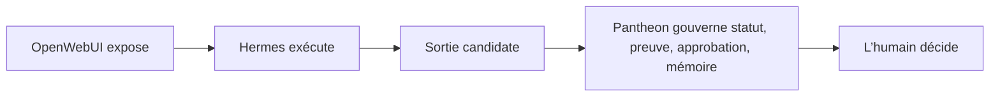

# Pantheon Next

> Noyau de gouvernance pour le travail professionnel assisté par IA.

[English version](README.md) · [Page publique](https://ifanjuang.github.io/Pantheon-Next/) · [Introduction professionnelle](docs/intro-professionnelle.md) · [Index de gouvernance](docs/governance/README.md) · [Contribuer](CONTRIBUTING.md)

Pantheon Next est un référentiel de gouvernance. Il définit comment un travail IA à conséquence professionnelle est cadré, relu, prouvé, approuvé, mémorisé et exposé à l’humain.

Ce n’est pas un moteur IA, un runtime d’agent, un scheduler, une queue, un routeur de providers, un gestionnaire de plugins, un installateur, un backend mémoire ou un système d’approbation automatique.

```text
OpenWebUI expose.
Hermes Agent exécute.
Pantheon Next gouverne.
```

## À lire d’abord

- Pour comprendre le projet, lire ce README.
- Pour savoir ce qui est réellement disponible, lire [`docs/governance/WHAT_RUNS.md`](docs/governance/WHAT_RUNS.md).
- Pour savoir ce qui fait autorité, lire [`docs/governance/AUTHORITY_INDEX.md`](docs/governance/AUTHORITY_INDEX.md).
- Pour travailler sur le repo, lire [`docs/governance/README.md`](docs/governance/README.md) et [`CONTRIBUTING.md`](CONTRIBUTING.md).

## État actuel

Pantheon Next est partiel mais structurellement cohérent.

Le repo contient aujourd’hui :

- une doctrine de gouvernance et des index de support ;
- une documentation GitHub Pages statique et des prototypes statiques ;
- des modèles candidats de domaine, workflow, cartes et capacités ;
- des artefacts de validation et de statut, dont une surface MCP de vérification read-only, encore partielle / à vérifier.

Il ne fournit pas aujourd’hui :

- un runtime d’exécution interne ;
- une boucle autonome d’agents ;
- une approbation automatique ;
- une promotion mémoire automatique ;
- du routage de providers, du scheduling, de la queue, de l’installation ou de l’exécution de mises à jour.

Si une page, un prototype, un schéma ou un asset semble suggérer un comportement runtime, [`docs/governance/WHAT_RUNS.md`](docs/governance/WHAT_RUNS.md) l’emporte.

La vérité du repo se lit dans cet ordre :

1. [`docs/governance/STATUS.md`](docs/governance/STATUS.md) — posture actuelle et exceptions actives.
2. [`docs/governance/WHAT_RUNS.md`](docs/governance/WHAT_RUNS.md) — ce qui tourne, ce qui est statique, ce qui est partiel, ce qui est absent.
3. [`docs/governance/AUTHORITY_INDEX.md`](docs/governance/AUTHORITY_INDEX.md) — classes d’autorité et règles de promotion.
4. [`docs/governance/MODULES.md`](docs/governance/MODULES.md) — zones de gouvernance et frontières runtime.

## Pourquoi ce repo existe

Une sortie IA en contexte professionnel n’est pas seulement du texte. Elle peut devenir une fausse vérité, une mauvaise mémoire, un effet externe non approuvé, une approbation invalide ou un engagement de responsabilité.

Pantheon Next donne à ces moments un chemin de gouvernance visible :

```text
ce qui peut entrer
ce qui peut être exposé
ce qui exige une preuve
ce qui exige une approbation
ce qui peut rester
```

L’outil propose. Le professionnel décide.

## Répartition des rôles

| Couche | Rôle | Frontière |
|---|---|---|
| OpenWebUI | Expose le cockpit, la vue dossier, les statuts et les surfaces de décision. | Ne gouverne pas et n’exécute pas. |
| Hermes Agent | Exécute à l’extérieur sous contrat : extraction, comparaison, rédaction, appels d’outils, production de candidats. | Ne s’auto-approuve pas, ne canonise pas la vérité, ne promeut pas la mémoire. |
| Pantheon Next | Gouverne les statuts, preuves, approbations, périmètres, mémoires et frontières d’action externe. | Ne devient pas le runtime. |
| Humain | Relit, valide, rejette, autorise ou signe. | La responsabilité finale reste visible. |

Chemin conceptuel de gouvernance, pas topologie runtime :



## Distinctions centrales

```text
installed        ≠ approved
healthy          ≠ safe
update_available ≠ update_authorized
runtime_success  ≠ evidence
binding_selected ≠ dependency_adopted
watchlist_item   ≠ install_instruction
```

Ces distinctions s’appliquent à toute capacité, skill, connecteur, workflow, modèle, runtime et dépôt externe examiné par Pantheon Next.

## Carte du repo

| Zone | Rôle |
|---|---|
| [`docs/governance/`](docs/governance/) | Doctrine, statut, autorité, modules, approbations, preuves, mémoire et frontières d’intégration. |
| [`docs/examples/`](docs/examples/) | Exemples professionnels fictifs. Utiles pour relire la méthode, pas pour produire un avis juridique ou technique. |
| [`docs/assets/`](docs/assets/) | Pages statiques, diagrammes et prototypes. La publication statique ne vaut pas disponibilité produit. |
| [`hermes/profiles/`](hermes/profiles/) | Templates légers de profils Hermes. Templates candidats, pas exécution installée. |
| [`schemas/`](schemas/) | Contrats de validation. Revue protégée requise. |
| [`tests/`](tests/) | Vérifications de validation lorsqu’elles existent. Les tests ne promeuvent pas la doctrine par eux-mêmes. |
| [`mcp-server/`](mcp-server/) | Surface read-only de politique / vérification. Partielle, protégée, à vérifier. |
| [`ai_logs/`](ai_logs/) | Trace d’intervention. Les logs ne sont pas doctrine. |

## Examiner une capacité externe

Pour tout dépôt externe, runtime, skill, connecteur ou workflow, classer le slot avant adoption :

```text
capacité abstraite
→ binding Hermes candidat
→ statut d’installation
→ statut de santé
→ statut de mise à jour
→ statut d’activation
→ gates Pantheon
→ approbation humaine
```

Avant d’adopter une capacité, répondre :

1. Quelle conséquence peut-elle produire ?
2. Qu’est-ce qui l’exécute ?
3. Qu’est-ce que Pantheon gouverne ?
4. Quelle preuve est requise ?
5. Quelle approbation humaine est nécessaire ?
6. Qu’est-ce qui doit rester interdit ?

Pantheon peut gouverner un control plane. Il peut afficher, qualifier, tracer et gater l’état d’un runtime externe. Il ne doit pas devenir silencieusement ce runtime.

## Travailler sur le repo

Avant tout travail significatif, lire les documents actifs du repo. Le repo l’emporte sur les anciens prompts, commentaires et plans historiques.

Vérification minimale :

```text
docs/governance/STATUS.md
docs/governance/WHAT_RUNS.md
docs/governance/AUTHORITY_INDEX.md
docs/governance/MODULES.md
docs/governance/README.md
CONTRIBUTING.md
```

Utiliser un langage de statut explicite :

```text
implemented
documented non-implemented
partial / to verify
candidate only
obsolete / refused
not applicable
```

Un candidat ne devient pas doctrine par ancienneté, répétition ou utilité. La promotion exige un référent explicite : schéma, test, exemple exécuté, surface read-only de vérification ou décision humaine datée dans `ai_logs/`.

## Licence

MIT — voir [`LICENSE`](LICENSE).

Copyright © 2026 IFJ Architecture.
