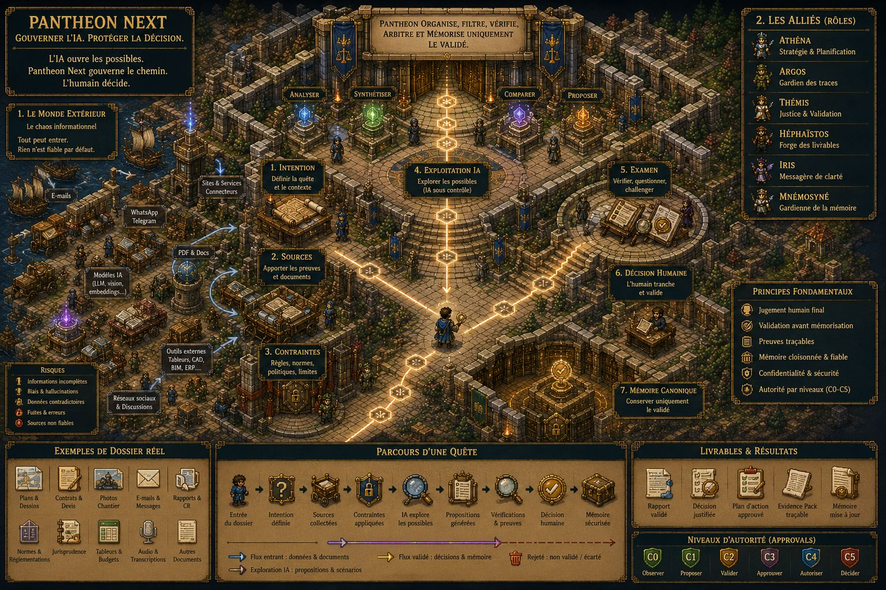
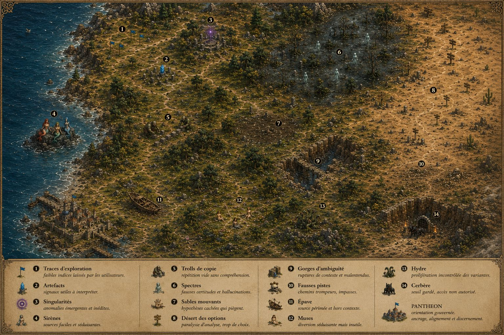
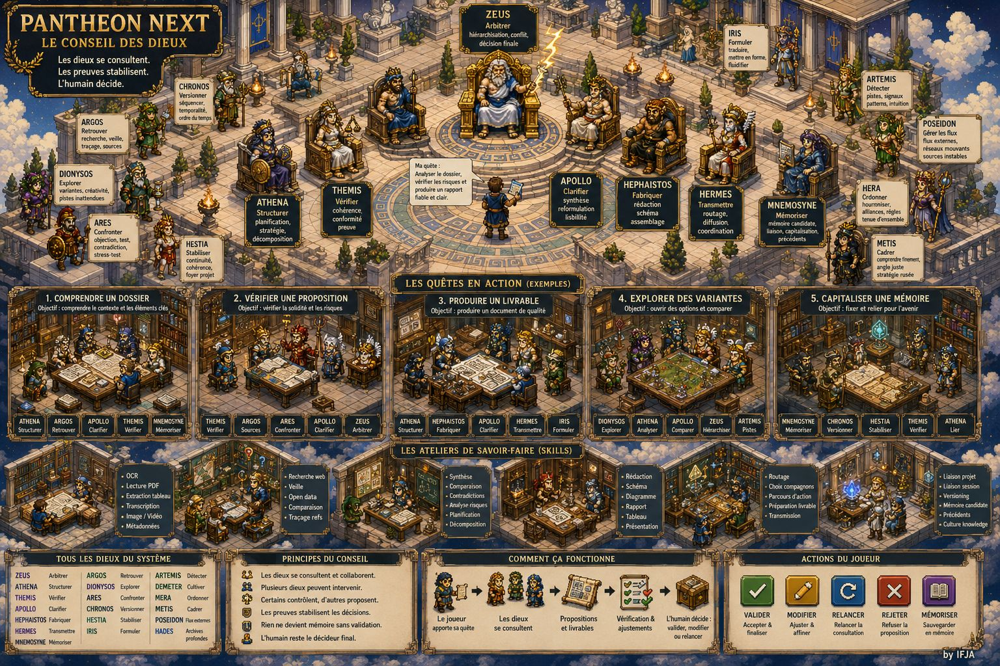

# Pantheon Next

> English version: [README.md](README.md)

> Sources. Preuves. Mémoire. Validation.  
> Une couche de gouvernance pour le travail professionnel assisté par IA.

**État actuel :** Pantheon Next est un repository de gouvernance et de documentation en bootstrap contrôlé. Il est structurellement cohérent, mais partiel. Certains documents sont de la doctrine active. D’autres sont des stubs. Certaines zones d’implémentation sont encore absentes. Pour l’état faisant foi, lire [`docs/governance/STATUS.md`](docs/governance/STATUS.md).

Pantheon Next aide les professionnels à utiliser l’IA sur des dossiers sensibles sans perdre la maîtrise des sources, des hypothèses, des preuves, de la mémoire et de la validation.

```text
OpenWebUI expose.
Hermes Agent exécute.
Pantheon Next gouverne.
```

L’IA peut accélérer la lecture, la comparaison, la rédaction, l’extraction et la revue. Elle peut aussi mélanger les contextes, lisser les contradictions et transformer une hypothèse fragile en certitude apparente.

Pantheon Next sert à empêcher cette dérive.

Il cadre la tâche, sépare la source de la preuve, garde la mémoire candidate jusqu’à validation et rend la décision humaine explicite.

```text
L’IA ouvre les possibles.
Pantheon les organise.
L’humain décide.
Le validé reste.
```

---

## Ce que ce repository est

Pantheon Next est une **couche de gouvernance** pour les workflows professionnels assistés par IA.

Il définit :

| Zone | Fonction |
|---|---|
| Doctrine | Les frontières opératoires du système. |
| Rôles | Des rôles cognitifs de gouvernance, pas des agents autonomes. |
| Task Contracts | Le cadre d’une tâche déléguée. |
| Evidence Packs | Le dossier de preuve qui rend un résultat relisible. |
| Niveaux d’approbation | Les seuils de décision pour l’action, la mémoire, la doctrine et le risque. |
| Politique mémoire | Le passage d’une information candidate vers une mémoire validée. |
| Taxonomie des connaissances | La distinction entre source, connaissance, contexte, preuve, mémoire et doctrine. |
| Politique des outils externes | Les règles pour les outils, connecteurs, écritures, providers et données sensibles. |
| Frontières d’intégration | Ce qu’OpenWebUI peut exposer et ce qu’Hermes Agent peut exécuter. |

Pantheon Next ne remplace pas le jugement professionnel. Il structure les conditions dans lesquelles une sortie IA peut devenir un travail professionnel.

---

## Ce que ce repository n’est pas

Pantheon Next n’est pas :

- un chatbot ;
- un runtime agentique autonome ;
- un tool runtime ;
- un routeur de providers LLM ;
- un scheduler ;
- une queue ou un message bus ;
- un runtime LangGraph central ;
- un moteur de workflow caché ;
- un plugin manager libre ;
- un système de mémoire auto-promue ;
- un installateur automatique de skills ;
- un dashboard à surveiller toute la journée ;
- un remplacement de la responsabilité professionnelle.

La règle est simple :

```text
Pantheon Next gouverne l’exécution.
Il ne l’exécute pas.
```

---

## Le modèle opératoire

Pantheon Next repose sur trois surfaces distinctes.

| Surface | Rôle | Frontière |
|---|---|---|
| OpenWebUI | Cockpit utilisateur | Chat, fichiers, Knowledge Bases, demandes d’approbation, résultats et affichage des Evidence Packs. Il ne canonise pas la mémoire et ne devient pas vérité. |
| Hermes Agent | Runtime d’exécution externe | Tools, skills, terminal, opérations fichiers, recherche, workers, subagents et travail opérationnel. Il retourne des candidats et des preuves. |
| Pantheon Next | Source de gouvernance | Doctrine, rôles, Task Contracts, approvals, Evidence Packs, règles de Canonical Memory, policies et context packs. |

OpenWebUI peut afficher. Hermes peut exécuter. Pantheon décide ce qui est légitime.

Hermes terminé ne veut pas dire Pantheon validé. Affiché dans OpenWebUI ne veut pas dire vérité canonique. Retrouvé par recherche ne veut pas dire mémoire.

---

## Boucle professionnelle

Pantheon transforme une demande IA vague en chemin professionnel contrôlé.

```text
Demande utilisateur
→ cadrage de tâche
→ entrée des sources
→ sélection du périmètre et du contexte
→ stratégie
→ exécution externe
→ Evidence Pack
→ revue humaine
→ sortie validée, sortie rejetée ou Memory Candidate
→ Canonical Memory possible uniquement après validation
```

La boucle doit rester continue lorsque le système peut travailler sans risque. Elle doit s’interrompre uniquement lorsque l’utilisateur doit valider, vérifier, choisir, fournir une information manquante ou accepter une action engageante.

C’est l’idée produit centrale : l’IA peut faire plus de travail entre les portes de validation, mais elle ne doit jamais franchir ces portes silencieusement.

---

## Pourquoi c’est utile

Un dossier professionnel n’est pas seulement un ensemble de documents. Il contient des obligations, des risques, des contradictions, des délais, des informations privées et des décisions qui peuvent engager la responsabilité.

Un dossier peut contenir contrats, plans, rapports, emails, devis, règlements, notes de réunion, PDFs, sources web, images, tableurs et versions contradictoires.

Sans gouvernance, l’IA produit surtout une réponse. Avec Pantheon, la cible est différente : un résultat qui peut être relu, contesté, limité, approuvé, rejeté ou mémorisé avec traçabilité.

| Sans Pantheon | Avec Pantheon |
|---|---|
| Une réponse utile, difficile à vérifier. | Une sortie relisible, liée aux sources et aux hypothèses. |
| Des sources dispersées entre les outils. | Des sources identifiées, bornées et enregistrées. |
| Des hypothèses qui peuvent devenir des faits cachés. | Des hypothèses visibles et discutables. |
| Une mémoire qui garde trop, ou mal. | Une mémoire qui reste candidate jusqu’à validation. |
| Des décisions difficiles à retracer. | Des preuves et un état d’approbation visibles. |
| Un usage IA fragmenté. | Un chemin de travail professionnel gouverné. |

---

## Premier scénario démontrable

Le premier scénario clair est la revue maîtrisée d’un dossier sensible.

```text
Dossier sensible
→ Task Contract
→ Exécution externe
→ Evidence Pack
→ Revue humaine
→ Sortie validée ou Memory Candidate
```

Entrées typiques :

- contrat ;
- CCTP ou descriptif technique ;
- devis ;
- rapport technique ;
- note juridique ;
- dossier projet ;
- fil d’emails ;
- transcription de réunion ;
- versions documentaires contradictoires.

Sorties typiques :

- synthèse des risques ;
- liste des obligations ;
- rapport de contradictions ;
- informations manquantes ;
- hypothèses à vérifier ;
- synthèse sourcée ;
- Memory Candidates ;
- checklist de validation finale.

Une démonstration réussie doit montrer ce qui a été demandé, quelles sources ont été utilisées, ce qui a été supposé, ce qui reste incertain, ce qui contredit quoi, ce qui demande validation, ce qui peut être transmis, ce qui peut devenir mémoire et ce qui doit être rejeté.

---

## Objets de gouvernance

| Objet | Rôle |
|---|---|
| Task Contract | Cadre l’intention, le périmètre, les sources, les contraintes, les sorties autorisées, les sorties interdites, le plafond d’approbation et les règles mémoire. |
| Evidence Pack | Conserve le dossier de preuve relisible : sources, hypothèses, actions, risques, sorties, revues, memory candidates et état d’approbation. |
| Approval Levels | Définissent les seuils de décision pour lecture, rédaction, actions réversibles, changements persistants, effets externes et actions critiques. |
| Memory Candidate | Information durable proposée. Elle n’est pas canonique par défaut. |
| Canonical Memory | Mémoire validée, bornée et reliée aux preuves. |
| Context Pack | Artefact de contexte borné pouvant être transmis à un runtime externe. |
| External Tools Policy | Gouverne les capacités qui lisent, transforment, écrivent, envoient, publient, configurent, exécutent ou influencent la mémoire. |
| AI Log | Trace les interventions significatives assistées par IA dans le repository. |

---

## Rôles Pantheon

Le fichier [`docs/governance/AGENTS.md`](docs/governance/AGENTS.md) conserve son nom historique, mais le concept canonique est **Pantheon Role**.

Les rôles sont des points de vue de gouvernance. Ce ne sont pas des agents runtime autonomes.

| Rôle | Fonction |
|---|---|
| ATHENA | Planification, décomposition et stratégie de workflow. |
| ARGOS | Recherche de sources, preuve et traçabilité. |
| THEMIS | Risque, conformité aux policies et limites d’approbation. |
| APOLLO | Revue qualité, complétude et préparation de livraison. |
| ZEUS | Arbitrage entre conflits ou variantes. |
| IRIS | Formulation, transmission et clarification côté utilisateur. |
| HEPHAISTOS | Préparation de build, patch candidates et implementation candidates. |

Les profils Hermes peuvent s’aligner sur ces rôles, mais ils restent des profils d’exécution candidate-only. Ils n’approuvent pas, ne canonisent pas et ne promeuvent pas la mémoire.

---

## Connaissance, preuve et mémoire

Pantheon Next n’utilise pas un grand seau de vérité unique.

```text
Raw Source       matière disponible
Knowledge        information de référence organisée
Context          information bornée à la tâche
Evidence         support sélectionné pour une affirmation ou une sortie
Memory Candidate information durable proposée
Canonical Memory mémoire approuvée, bornée et reliée aux preuves
Doctrine         couche de règles
Runtime State    état d’exécution externe, jamais mémoire canonique
```

Une source n’est pas automatiquement une preuve.

Un document retrouvé n’est pas automatiquement une vérité.

Une Knowledge Base OpenWebUI n’est pas une Canonical Memory.

Une sortie modèle n’est pas une mémoire.

Une observation répétée n’est pas une mémoire.

La mémoire ne devient canonique qu’avec preuve, revue, périmètre et approbation.

---

## Les outils du quotidien comme entrées gouvernées

Pantheon Next ne remplace pas les outils professionnels. Il gouverne la manière dont leurs informations peuvent entrer dans un dossier.

| Canal | Rôle | État actuel |
|---|---|---|
| OpenWebUI | Cockpit utilisateur principal | Doctrine de cockpit visée. |
| Hermes Agent | Runtime d’exécution externe | Doctrine de runtime visée. |
| Fichiers locaux et PDFs | Matière documentaire du dossier | Entrée visée. |
| Email, Gmail, Outlook | Messages et pièces jointes | Point d’entrée gouverné visé. |
| Google Drive, Docs, Sheets | Documents et sources tabulaires | Point d’entrée gouverné visé. |
| Documents Office | Fichiers professionnels et exports | Point d’entrée gouverné visé. |
| Calendriers et notes | Échéances, rappels et notes de travail | Point d’entrée gouverné visé. |
| Notion, Trello, Slack | Connaissance projet et échanges équipe | Point d’entrée gouverné visé. |
| WhatsApp, Telegram | Messages, notes vocales et images | Futur point d’entrée gouverné. |
| Recherche web | Découverte de sources externes | Flux externe gouverné. |

Ces éléments ne sont pas des connecteurs Pantheon intégrés automatiquement, sauf implémentation séparée dans la couche d’exécution externe.

Les outils restent des canaux. Ils ne deviennent pas vérité.

---

## Parcours visuel

Pantheon utilise une métaphore de cité-jeu pour expliquer le modèle de gouvernance aux utilisateurs professionnels non techniques. La couche visuelle est une doctrine explicative. Elle ne redéfinit pas Pantheon comme moteur de jeu, cité autonome, workflow runner caché ou runtime.

La séquence visuelle du README doit suivre le parcours utilisateur, pas la stack technique.

### 1. Player — le professionnel décide

<table>
<tr>
<td width="52%" align="center">
<a href="docs/assets/pantheon-rpg/references/player_01_fr.jpg">

</a>
</td>
<td width="48%" valign="top">

Le joueur est l’utilisateur professionnel.

Il apporte l’intention, les sources, le contexte, les contraintes, l’expertise et le jugement final.

Pantheon structure le chemin.

L’IA accélère certaines tâches.

La responsabilité reste humaine.

</td>
</tr>
</table>

### 2. Worldmap — le monde extérieur de l’information

<table>
<tr>
<td width="52%" align="center">
<a href="docs/assets/pantheon-rpg/references/worldmap_01_fr.jpg">

</a>
</td>
<td width="48%" valign="top">

L’IA, le web et les connaissances externes forment un monde instable.

Connaissances utiles, sources faibles, informations obsolètes, contradictions et découvertes inattendues coexistent.

Pantheon ne ferme pas ce monde.

Il donne au professionnel une méthode pour le traverser sans confondre signal, source, preuve et mémoire.

</td>
</tr>
</table>

### 3. Port — les sources et canaux entrent sous contrôle

<table>
<tr>
<td width="52%" align="center">
<a href="docs/assets/pantheon-rpg/references/port_01_fr.jpg">

</a>
</td>
<td width="48%" valign="top">

Le port représente les flux externes : web, emails, fichiers, APIs, messageries et connecteurs.

Pantheon gouverne ce qui peut entrer dans le dossier, ce qui doit rester temporaire, ce qui doit être rejeté et ce qui peut devenir preuve.

Les outils restent des canaux.

Ils ne deviennent pas vérité.

</td>
</tr>
</table>

### 4. Citadel — le dossier gouverné

<table>
<tr>
<td width="52%" align="center">
<a href="docs/assets/pantheon-rpg/references/citadel_01_fr.jpg">

</a>
</td>
<td width="48%" valign="top">

La citadelle représente le dossier professionnel gouverné.

Les sources passent par des portes contrôlées.

Les hypothèses restent visibles.

La mémoire ne se promeut pas seule.

Le professionnel décide ce qui demeure.

</td>
</tr>
</table>

### 5. Evidence — la preuve avant la confiance

Image à produire : `docs/assets/pantheon-rpg/references/evidence_01_fr.jpg`.

Cette planche doit montrer les sources retenues, les hypothèses, les contradictions, les tables de revue et un Evidence Pack scellé. Son message est précis : la preuve soutient la revue, mais elle ne s’approuve pas elle-même.

### 6. Livrables — les sorties candidates avant transmission

Image à produire : `docs/assets/pantheon-rpg/references/livrables_01_fr.jpg`.

Cette planche doit montrer rapports, tableaux, courriers, diagrammes, présentations et exports sortant des ateliers uniquement après revue. Un livrable reste candidat tant que le chemin d’approbation requis n’est pas complet.

### 7. Pantheon — rôles de jugement, pas agents autonomes

<table>
<tr>
<td width="52%" align="center">
<a href="docs/assets/pantheon-rpg/references/olympus_01_fr.jpg">

</a>
</td>
<td width="48%" valign="top">

Pantheon représente les rôles cognitifs gouvernés.

Planification, preuve, revue du risque, qualité, arbitrage, formulation et candidats d’implémentation restent distincts.

Ces figures sont des rôles de gouvernance et des fonctions cognitives.

Ce ne sont pas des agents runtime autonomes.

</td>
</tr>
</table>

---

## État d’implémentation actuel

Pantheon Next fournit aujourd’hui une base de gouvernance documentaire.

Implémenté ou documenté :

- doctrine de gouvernance ;
- doctrine de frontière runtime ;
- registre des Pantheon Roles ;
- doctrine des Task Contracts ;
- doctrine des Evidence Packs ;
- doctrine des approvals ;
- doctrine mémoire ;
- politique des outils externes ;
- doctrine d’intégration OpenWebUI ;
- doctrine d’intégration Hermes ;
- taxonomie des connaissances et cadrage des scopes ;
- assets narratifs et visuels ;
- templates légers de profils Hermes.

Non implémenté dans ce repository :

- runtime autonome ;
- intégration runtime OpenWebUI ;
- intégration runtime Hermes ;
- génération automatique d’Evidence Packs ;
- interface de revue des Memory Candidates ;
- provider routing ;
- plugin management ;
- réconciliation des schemas ;
- tests ;
- outillage read-only operations ;
- stack de déploiement.

L’état doit être vérifié capacité par capacité dans [`docs/governance/STATUS.md`](docs/governance/STATUS.md).

---

## Structure du repository

```text
docs/governance/     doctrine de gouvernance et documents de statut
hermes/profiles/     templates légers de profils Hermes candidate-only
docs/assets/         références narratives et visuelles
ai_logs/             historique des interventions assistées par IA
legacy/              source historique Pantheon OS
schemas/             contrats déclaratifs attendus, non réconciliés
operations/          outillage read-only attendu, non implémenté
tests/               tests attendus, non implémentés
```

Points d’entrée principaux :

| Document | Fonction |
|---|---|
| [`docs/governance/STATUS.md`](docs/governance/STATUS.md) | État faisant foi du repository. |
| [`docs/governance/README.md`](docs/governance/README.md) | Index de gouvernance et ordre de lecture. |
| [`docs/governance/ARCHITECTURE.md`](docs/governance/ARCHITECTURE.md) | Anatomie de gouvernance et modèle de frontière. |
| [`docs/governance/AGENTS.md`](docs/governance/AGENTS.md) | Registre canonique des Pantheon Roles. |
| [`docs/governance/TASK_CONTRACTS.md`](docs/governance/TASK_CONTRACTS.md) | Doctrine de cadrage des tâches. |
| [`docs/governance/EVIDENCE_PACK.md`](docs/governance/EVIDENCE_PACK.md) | Doctrine de preuve. |
| [`docs/governance/MEMORY.md`](docs/governance/MEMORY.md) | Doctrine de promotion mémoire. |
| [`docs/governance/APPROVALS.md`](docs/governance/APPROVALS.md) | Niveaux d’approbation. |
| [`docs/governance/HERMES_INTEGRATION.md`](docs/governance/HERMES_INTEGRATION.md) | Doctrine de frontière Hermes. |
| [`docs/governance/OPENWEBUI_INTEGRATION.md`](docs/governance/OPENWEBUI_INTEGRATION.md) | Doctrine de frontière OpenWebUI. |
| [`docs/governance/EXTERNAL_TOOLS_POLICY.md`](docs/governance/EXTERNAL_TOOLS_POLICY.md) | Gouvernance des capacités externes. |
| [`docs/governance/KNOWLEDGE_TAXONOMY.md`](docs/governance/KNOWLEDGE_TAXONOMY.md) | Vocabulaire source, connaissance, contexte, preuve et mémoire. |

Lorsque des documents se contredisent, traiter `STATUS.md` comme première référence de statut jusqu’à réconciliation.

---

## Priorités proches

- construire un dossier de démonstration fictif ;
- fournir un exemple de Task Contract ;
- fournir un exemple d’Evidence Pack ;
- produire les planches manquantes `evidence_01_fr.jpg` et `livrables_01_fr.jpg` ;
- clarifier l’état d’implémentation par capacité ;
- documenter les premiers packs de cas d’usage professionnels ;
- préparer des exemples de handoff OpenWebUI et Hermes ;
- reconsidérer les schemas sous règle de fichier protégé ;
- ajouter un outillage de validation read-only uniquement s’il préserve la frontière de gouvernance.

---

## Principe final

```text
L’IA produit des possibles.
Pantheon gouverne le chemin.
Hermes exécute le travail.
OpenWebUI expose le résultat.
L’humain décide.
Le validé reste.
```
