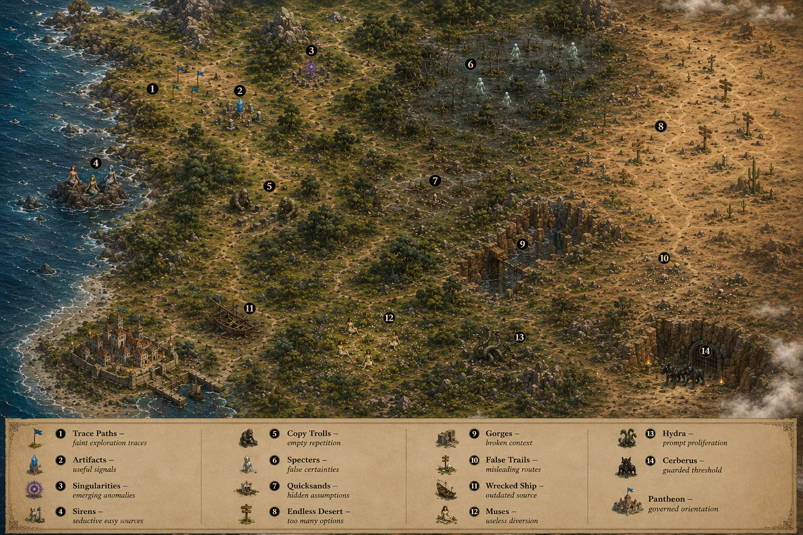
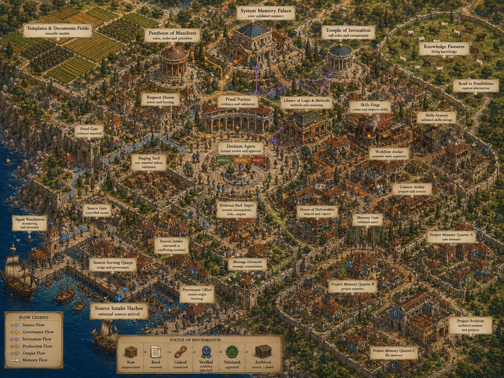
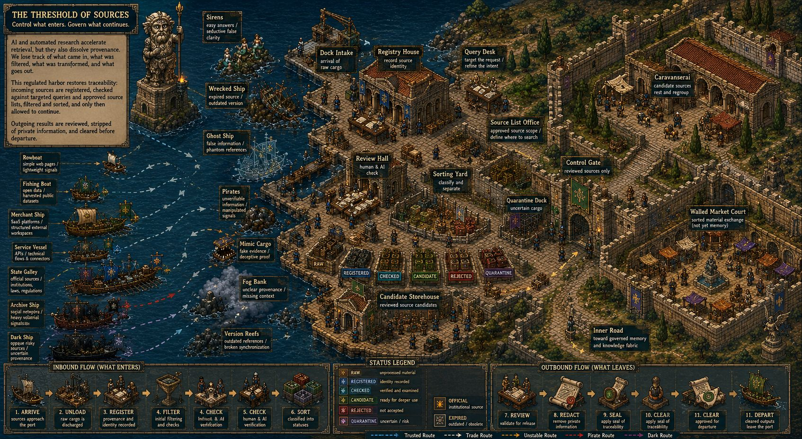
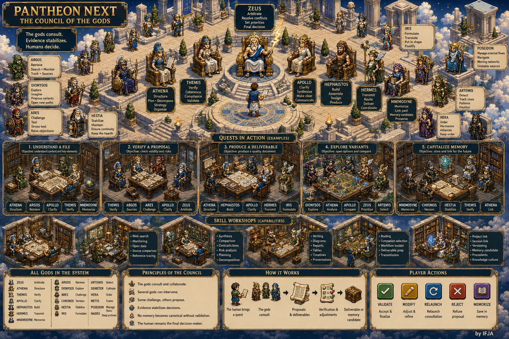
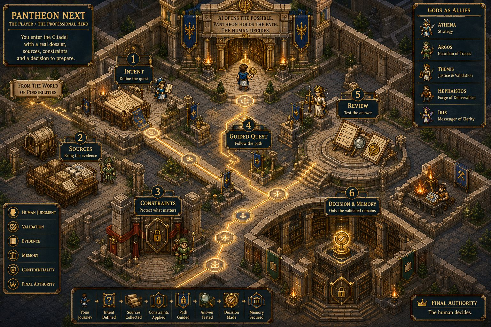

# Pantheon Next

> Version française : [README.fr.md](README.fr.md)

> Governance layer for professional AI work.

Pantheon Next transforms AI outputs into traceable, evidence-linked and approval-bound work products.

It helps professionals use AI on sensitive dossiers without losing confidentiality, source control, project isolation, governed memory or human authority.

```text
AI opens the possible.
Pantheon frames the work.
Hermes executes.
OpenWebUI exposes.
The human decides.
Only the validated remains.
```

A useful AI answer is not enough.

A professional answer must be traceable.

You delegate execution.

You never delegate the decision.

---

## The problem

Most AI tools start with a prompt.

Professional work starts with a dossier.

A contract. A plan. A report. A client email. A quote. A regulation. A meeting note. A sensitive PDF. A web source. A set of conflicting versions.

AI can accelerate this work.

It can also contaminate it.

It mixes useful signals with assumptions, outdated information, weak sources, false certainty and context leakage. The danger is not only that AI can be wrong. The danger is that it can be wrong convincingly, then reused, stored or transferred into the wrong professional context.

Pantheon Next exists to govern that risk.

---

## The product

Pantheon Next is not another chatbot.

It is a governance layer that frames how AI work is requested, executed, reviewed, preserved or rejected.

It does this through concrete governance objects:

| Object | Role |
|---|---|
| Task Contract | Frames the request, scope, sources, limits, expected output and validation level. |
| Evidence Pack | Records sources, assumptions, risks, contradictions, tools, actions and decisions. |
| Approval Levels | Define what can be drafted, executed, transmitted, memorized or canonized. |
| Memory Candidate | Information proposed for retention, never canonical by default. |
| Canonical Memory | Validated, scoped and evidence-linked memory. |
| External Tools Policy | Controls what can enter, leave, be filtered, anonymized or rejected. |
| Context Pack | Gives execution layers the minimum governed context they need. |
| AI Log | Keeps a trace of significant AI-assisted interventions. |

Pantheon does not replace professional judgment.

It structures the conditions under which AI output can become professional work.

---

## First use case

### Governed sensitive dossier review

The first practical use case is simple:

```text
Upload dossier
→ Generate or apply Task Contract
→ Execute analysis externally
→ Produce Evidence Pack
→ Human review
→ Validated output or memory candidate
```

Example inputs:

- contract;
- CCTP;
- quote;
- technical report;
- legal memo;
- project folder;
- email thread;
- meeting transcript;
- contradictory document versions.

Example outputs:

- risk summary;
- obligations list;
- contradiction report;
- missing information;
- assumptions to verify;
- sourced synthesis;
- memory candidates;
- final validation checklist.

The result is not just an AI answer.

It is a reviewable work object.

---

## Why not just ChatGPT?

ChatGPT can answer.

Pantheon structures the work around the answer.

It adds:

- source control;
- task framing;
- dossier isolation;
- evidence tracking;
- approval levels;
- governed memory;
- human validation;
- external tool boundaries;
- traceable decision paths.

You delegate execution.

You never delegate the decision.

---

## Who this is for

Pantheon Next is designed for professionals handling sensitive, complex or responsibility-bearing dossiers:

- architects;
- lawyers;
- doctors;
- engineers;
- consultants;
- researchers;
- design offices;
- expert firms;
- public-sector teams;
- documentation-heavy organizations.

These are workflows where AI speed is useful, but untraced output is a liability.

---

## Operating doctrine

```text
OpenWebUI exposes.
Hermes Agent executes.
Pantheon Next governs.
```

OpenWebUI is the user cockpit: chat, files, Knowledge Bases, results, validation requests and Evidence Pack display.

Hermes Agent is the external execution runtime: OCR, transcription, search, comparison, extraction, skills, tools, workers and operational workflows.

Pantheon Next is the governance layer: doctrine, roles, Task Contracts, approvals, Evidence Packs, memory policy, context packs and external tools policy.

This boundary is central.

Pantheon Next governs execution.

It does not execute.

---

## What Pantheon Next is not

Pantheon Next is not:

- a chatbot;
- an autonomous agent runtime;
- a tool runtime;
- an LLM provider router;
- a scheduler;
- a hidden workflow engine;
- a free plugin manager;
- a self-promoting memory system;
- a replacement for professional judgment.

Pantheon defines the rules of professional AI work.

It does not become the runtime.

---

## How it works in practice

You do not start by configuring agents.

You start with a professional situation.

1. **Bring intent**  
   A question, dossier, document, decision or deliverable to prepare.

2. **Add sources**  
   PDFs, emails, plans, notes, web links, transcripts, images or project files.

3. **Set constraints**  
   Confidentiality, project scope, external access, expected output and validation level.

4. **Frame the task**  
   Pantheon creates or applies a Task Contract.

5. **Execute under contract**  
   Hermes or another external runtime performs extraction, OCR, transcription, comparison, research or synthesis.

6. **Review the Evidence Pack**  
   Sources, assumptions, contradictions, risks and weak points remain visible.

7. **Decide what remains**  
   The human validates, rejects, corrects, transmits or promotes memory candidates.

---

## Everyday tools as governed entry points

Pantheon does not replace everyday tools.

It governs what they can bring into the professional dossier.

| Channel | Role | Status |
|---|---|---|
| OpenWebUI | Main user cockpit | Target cockpit |
| Hermes Agent | External execution runtime | Target runtime |
| Local files / PDFs | Dossier material | Target input |
| OCR / transcription | Document and voice processing | Target execution capability |
| Gmail | Emails and attachments | Target governed entry point |
| Google Drive / Docs / Sheets | Documents and tabular sources | Target governed entry point |
| Google Calendar / Keep | Deadlines, notes and reminders | Target governed entry point |
| Notion / Trello | Tasks, project knowledge and boards | Target governed entry point |
| WhatsApp / Telegram | Messages, voice notes and images | Future governed entry point |
| Web search | External source discovery | Governed external flow |

These are target governed entry points, not automatic built-in Pantheon runtime connectors unless separately implemented in the external execution layer.

These tools remain channels.

They do not become canonical memory.

Not every source becomes truth.

---

## Current status

Pantheon Next is currently a governance and documentation layer.

Implemented or documented:

- governance doctrine;
- runtime boundary;
- role model;
- Task Contract concepts;
- Evidence Pack concepts;
- approval levels;
- memory taxonomy;
- external tools policy;
- OpenWebUI integration doctrine;
- Hermes integration doctrine;
- narrative and visual assets.

Target or future:

- full OpenWebUI cockpit workflow;
- Hermes execution handoff;
- generated Evidence Packs;
- memory candidate review UI;
- governed external entry points;
- demo dossier walkthrough;
- professional use-case packs.

This README describes the product direction and governance model.

Implementation status must be verified in the dedicated governance and technical documents.

---

## MVP scenario

The first demonstrable scenario should be:

```text
Sensitive PDF dossier
→ Task Contract
→ OCR / extraction / comparison
→ Evidence Pack
→ Human validation
→ Memory candidates
```

A successful demo should show:

- what was asked;
- which sources were used;
- what was assumed;
- what was uncertain;
- what contradicted what;
- what requires validation;
- what can be transmitted;
- what can become memory;
- what must be rejected.

That is the core product.

---

## Visual metaphor

Pantheon Next uses a RPG-inspired visual language to make hidden AI governance mechanisms easier to understand.

The metaphor does not replace the product.

It explains it.

### World of Possibilities

<table>
<tr>
<td align="center">
<h3>World of Possibilities</h3>
<a href="docs/assets/pantheon-rpg/references/worldmap_01.jpg">

</a>
<br><br>
AI and the web form an unstable world: useful knowledge, traps, illusions, weak sources, obsolete information and unexpected discoveries.
</td>
</tr>
</table>

### The Citadel

<table>
<tr>
<td align="center">
<h3>The Governed Citadel</h3>
<a href="docs/assets/pantheon-rpg/references/citadel_01.jpg">

</a>
<br><br>
The citadel represents governance: roles, approvals, memory layers, evidence, constraints and validations.
</td>
</tr>
</table>

### The Port

<table>
<tr>
<td align="center">
<h3>The Port</h3>
<a href="docs/assets/pantheon-rpg/references/port_01.jpg">

</a>
<br><br>
The port represents external flows: web, email, files, APIs, messengers and connectors. Everything entering the dossier must be filtered, classified or rejected.
</td>
</tr>
</table>

### Olympus

<table>
<tr>
<td align="center">
<h3>Olympus</h3>
<a href="docs/assets/pantheon-rpg/references/olympus_01.jpg">

</a>
<br><br>
Olympus represents governed cognitive roles: structure, evidence, validation, synthesis, execution, transmission and arbitration.
</td>
</tr>
</table>

These figures are governance roles and cognitive functions.

They are not autonomous runtime agents.

### The Player

<table>
<tr>
<td align="center">
<h3>The Professional Hero</h3>
<a href="docs/assets/pantheon-rpg/references/player_01.jpg">

</a>
<br><br>
The player is the professional user: bringing intent, sources, constraints, expertise and final judgment.
</td>
</tr>
</table>

Pantheon structures the quest.

AI accelerates the work.

The human decides what remains.

---

## Security and memory

Uploading sensitive professional information into uncontrolled AI systems is not a trivial action.

Pantheon Next is designed around:

- dossier isolation;
- local-first preference where possible;
- controlled memory;
- anonymization;
- external output filtering;
- governed connectors;
- evidence trails;
- human approval;
- memory promotion rules;
- scoped canonical memory.

A generated answer is not automatically truth.

A retrieved source is not automatically evidence.

A memory candidate is not canonical memory.

Memory remains scoped, reviewable, evidence-linked and governable.

---

## Repository structure

```text
/docs/governance/     canonical governance doctrine
/hermes/profiles/     lightweight Hermes profile templates
/docs/assets/         narrative and visual references
/schemas/             expected declarative contracts, not reconciled yet
/ai_logs/             AI intervention history
/legacy/              historical Pantheon OS source
```

For the authoritative governance status, see:

```text
docs/governance/STATUS.md
```

---

## Roadmap

Near-term priorities:

- create a full fictional demo dossier;
- provide a sample Task Contract;
- provide a sample Evidence Pack;
- add a simple product diagram;
- clarify implementation status by capability;
- document first professional use cases;
- prepare OpenWebUI / Hermes handoff examples.

---

## Final principle

```text
AI produces possibilities.
Pantheon governs the path.
Hermes executes the work.
OpenWebUI exposes the result.
The human decides.
Only the validated remains.
```
