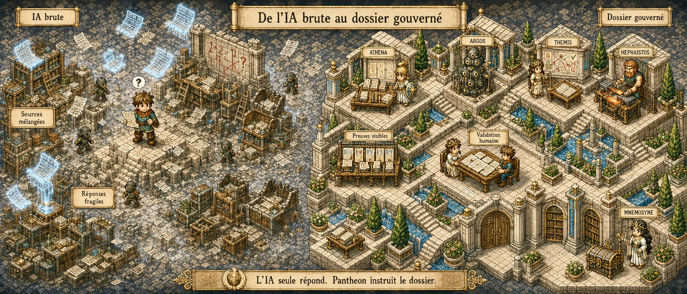
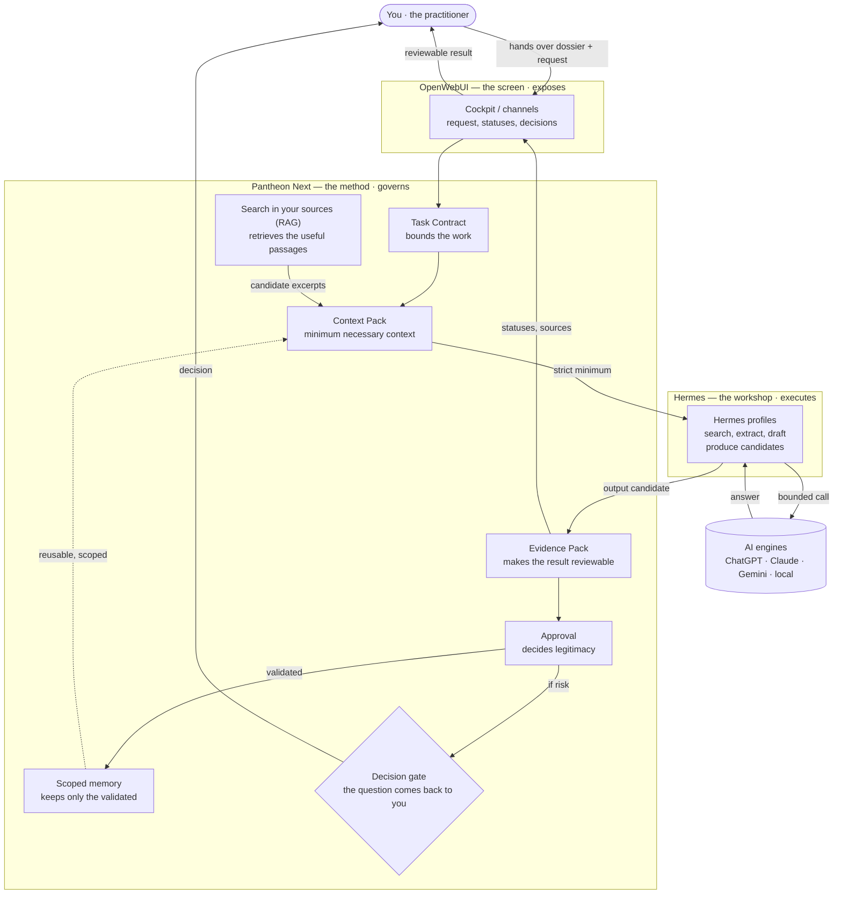

# Pantheon Next

> Version française : [README.fr.md](README.fr.md)

> **The professional-conduct frame between you, your usual tools, and AI engines: what enters, what is sent out, what leaves, and what remains.**

<sub><strong>Current status:</strong> Pantheon Next is a method and documentation repository under active structuring. It is coherent, but partial. For authoritative implementation status, read <a href="docs/governance/STATUS.md">docs/governance/STATUS.md</a>.</sub>

**You already use AI. But who answers for what it writes? You do.**

You would not hand a whole dossier to an outside engineering office: you give it a clear brief and just what it needs to work. Pantheon does the same with AI — from the tool you already use, with the engine of your choice (ChatGPT, Claude, Gemini, or a local model).

```text
you → [ Pantheon: what enters ] → AI → [ Pantheon: what leaves ] → you decide
```

It frames what enters, what is sent to the AI, what leaves, and what remains, according to the rules of your profession. *Answering is not acting:* the AI proposes, you decide. You keep your hand on sources, decisions and signatures — from the first draft to your sign-off.

**One example.** A recovery quote needs a client email. Most assistants will hand you a polished message that says *yes* — and quietly commit you. Pantheon stops on the question that matters: *does this email validate, accept, approve a scope, or engage you externally?* If it does, it prepares the message but holds the send: transmission stays your visible decision. If not, it lets you send it. Nothing commits you by accident.

**In plain terms:**

- you write from your usual channel;
- Pantheon sends the AI only the minimum necessary context, not the whole dossier;
- the answer comes back with a status — draft, to verify, candidate;
- you validate, correct or reject;
- nothing leaves without a status, nothing remains without validation.

```text
Fluent answer ≠ safe answer.
Answering     ≠ acting.
Drafted       ≠ sent.
Sent          ≠ true.
```

## Four questions, four answers

For an architect still on the fence.

| Your question | Pantheon's answer |
|---|---|
| *What does the AI see of my dossier?* | The minimum the task needs. For a surface note to a client, it gets the floor area and the brief — not the client's identity or the rest of the dossier. |
| *What if it gets it wrong?* | Every output comes with a status and its sources. A setback line taken from an old zoning plan is marked "to verify", not delivered as settled. |
| *Do I keep control?* | Always. The AI drafts the quote-approval email; you decide to send it. The signature stays yours. |
| *And next time?* | Pantheon keeps only what you validated and scoped. The height allowed on one plot stays tied to that plot, not reused elsewhere by mistake. |

## Who this is for

Professionals who answer for what they send: architects, lawyers, doctors, accountants, engineers, consultants. Regulated work, real liability, no room for a confident answer that turns out wrong.

No technical skill required. You keep control of sources, decisions and signatures.

## What you get

- **Nothing leaves by accident.** Every output carries a status. Transmission is a decision, not a side effect.
- **An audit-ready trail.** Sources, assumptions, contradictions and approvals stay visible and reviewable.
- **The right work shape before execution.** Pantheon asks whether the task needs one reasoning context, distributed extraction, role-team handoff or bounded swarm before the engine works.
- **Memory you can trust.** Only validated, scoped, evidence-linked information is kept for later.

## How a dossier flows

<p align="center">
  <a href="docs/assets/pantheon-rpg/references/before_after_01_fr.jpg">
    
  </a>
</p>

<p align="center"><strong>Before and after.</strong><br><em>A raw answer is fast. Pantheon turns the work into a visible dossier path.</em></p>

Speed is easy. Control is the hard part. Pantheon adds the path that responsibility-bearing work needs:

```text
request
→ mission sheet
→ source and scope selection
→ minimum necessary context
→ evidence topology check
→ candidate work
→ proof folder
→ review
→ human decision
→ optional scoped memory
```

It never exposes the whole dossier. It prepares the minimum necessary context — enough to work, not enough to expose everything. Four gates govern the flow:

| Gate | Question |
|---|---|
| Entry | Which sources, documents or facts may enter the working perimeter? |
| Context | What is the smallest sufficient context for this task? |
| Output | What may be produced, under which status, and for which recipient? |
| Memory | What may remain, under which scope, with which proof and approval? |

An interactive map shows how the pieces connect — the screen, the workshop, the method, the engines, the documents and the memory: [open the interactive map](docs/assets/pantheon-map/pantheon_next_mindmap_d3_v3_animated.html). (GitHub does not render it inline; open it by link.)

## You hand over the dossier, the system sorts it

You do not have to carve up your dossier yourself. You hand over your material — a zoning plan, a soil report, client exchanges, a specification — and, depending on your request, the system reads it, classifies it, and decides what to do with each piece:

| Action | What it means |
|---|---|
| **Keep** | information useful to the task is held for the work at hand. |
| **Flag** | a sensitive point is raised — a contradiction, a doubtful figure, a clause that commits you. |
| **Send** | only the strict minimum goes to the AI; the rest of the dossier never leaves your perimeter. |
| **Ask** | when in doubt, the system puts the question back to you instead of deciding alone. |

The sorting depends on your request. A surface note and a commitment letter do not trigger the same filter: the first needs the floor area and the brief; the second needs every phrase that could bind you to be spotted.

### RAG, in plain terms

"RAG" is a technical term most people have never met. In plain terms it is simply this: **instead of giving everything to the AI, we first search your documents for the passages that answer the question, and send only those.**

Picture an assistant who, before answering, opens your binders, finds the two pages about your plot, and works from those pages — not the whole binder. That is RAG: *retrieve first, answer second, from your own sources.*

Two consequences for you:

- **less exposure** — the AI sees only the useful excerpt, not the whole dossier;
- **answers tied to your material** — each element can be traced back to its source, so it is checkable.

Finding the right passage is not proving it. A retrieved excerpt stays a *candidate*: it is marked, linked to its source, and you validate it. The filtering and document search are described here as method; for what is actually available, read [`docs/governance/STATUS.md`](docs/governance/STATUS.md).

## Six honest distinctions

The whole method fits in six lines:

```text
Fluent answer  ≠ safe answer.
Found source   ≠ proof.
Draft          ≠ deliverable.
Sent           ≠ true.
Repeated fact  ≠ memory.
Role agreement ≠ approval.
```

The tool proposes. The professional validates, rejects or asks for revision. Pantheon keeps the path between those two reviewable, and asks for a human decision when risk exceeds safe procedure.

## Cloud or local: your choice

Pantheon does not lock you into one engine. Use an external service such as ChatGPT, Claude or Gemini, with private names, addresses, client references or sensitive excerpts masked or minimized before anything leaves. Or run a local model on your own hardware for more containment, at the cost of maintenance and discipline.

Either way: the engine receives only the necessary context, Pantheon frames the method, and the professional validates.

## From your usual channels

Pantheon does not ask you to adopt a new interface. It sits behind the one you already use — a messaging app such as WhatsApp or Telegram, your email, or the OpenWebUI cockpit. You write where you are used to writing; the professional-conduct frame applies the same way everywhere.

And the distinction that matters: *answering is not acting*. The AI can draft an email, prepare a letter, propose a reply. But preparing is not sending. Sending stays a visible decision by the practitioner — or, if the practitioner explicitly decides so, a bounded and traced action, never a side effect.

```text
Answering ≠ acting.
Drafted   ≠ sent.
```

These channels and assisted sending are described here as method. For what is actually available today, read [`docs/governance/STATUS.md`](docs/governance/STATUS.md).

## See it on real dossiers

The examples are fictional and educational. They do not replace professional advice.

1. [`architecture_devis_reprise/`](docs/examples/architecture_devis_reprise/) — recovery quote and dangerous client validation.
2. [`architecture_legal_module_panel/`](docs/examples/architecture_legal_module_panel/) — future cockpit panel for architecture + legal domains, role readiness, blockers and skill eligibility.
3. [`regulatory_watch_conflict/`](docs/examples/regulatory_watch_conflict/) — new external rule versus active dossier assumptions.
4. [`evidence_topology/`](docs/examples/evidence_topology/) — topology examples for context, fan-out extraction, handoff and Evidence Pack structure.
5. [`understand_anything_structural_analysis/`](docs/examples/understand_anything_structural_analysis/) — external graph analysis framed as candidate evidence, not authority.
6. [`legal_note/`](docs/examples/legal_note/) — legal strategy note with source verification needs.
7. [`medical_letter/`](docs/examples/medical_letter/) — referral letter with minimized data exposure.

The point is not that Pantheon decides. The point is that the decision path stays reviewable.

<details>
<summary>Under the hood (vocabulary, roles, architecture)</summary>

### Three parts

| Element | Role in the dossier |
|---|---|
| **OpenWebUI (the screen)** | The visible place: ask, read, select documents, see sources, validate. |
| **Hermes Agent (the workshop)** | The preparation place: search, extract, compare, convert, draft, produce candidates. |
| **Pantheon Next (the method)** | The frame: what enters, the minimum necessary context, what leaves, what remains. |

The internal doctrine:

```text
OpenWebUI exposes.
Hermes Agent executes.
Pantheon Next governs.
```

### The modules and how they relate

The diagram below shows how the pieces chain together: you hand over the dossier and the request through the screen; Pantheon bounds the work (Task Contract), prepares the minimum context and pours into it the passages retrieved from your sources (RAG); Hermes executes by calling an AI engine; the result comes back as an output candidate, becomes an Evidence Pack, passes through approval, and only the validated part is kept in scoped memory. When risk exceeds safe arbitration, the question comes back to you.



Each box has one job. An output stays a *candidate* until you validate it; a retrieved excerpt is not proof; nothing enters memory without approval. For the full object map and its boundaries, read [`docs/governance/CORE_CONCEPTS_MAP.md`](docs/governance/CORE_CONCEPTS_MAP.md).

### Seven review angles, one human decision

You do not need to memorize these names. They are internal review angles, not autonomous agents.

| Role | Plain-language function |
|---|---|
| ATHENA | Organizes the problem and prepares the plan. |
| ARGOS | Looks for sources and checks traceability. |
| THEMIS | Checks risk, rules and approval limits. |
| APOLLO | Reviews clarity, completeness and delivery quality. |
| ZEUS | Arbitrates status and next procedure when options conflict. |
| IRIS | Reformulates, clarifies and prepares user-facing communication. |
| HEPHAISTOS | Prepares files, correction candidates and implementation paths. |

These angles can expose useful disagreement before the professional validates anything. Hermes profiles may align with them, but they remain limited execution profiles: they do not approve, canonize or promote memory. See [`docs/governance/GOVERNANCE_COLLEGE.md`](docs/governance/GOVERNANCE_COLLEGE.md) and [`docs/governance/USER_DECISION_GATE.md`](docs/governance/USER_DECISION_GATE.md).

### Evidence topology

Pantheon does not choose between single-agent and multi-agent as a slogan. It first asks what shape the proof has.

If the answer depends on connecting evidence across sources, Pantheon preserves one primary reasoning context. If the work can be safely distributed, workers return Evidence Items or Handoff Artifacts, not authority.

See [`docs/governance/EVIDENCE_TOPOLOGY_GATE.md`](docs/governance/EVIDENCE_TOPOLOGY_GATE.md) and [`docs/governance/EVIDENCE_TOPOLOGY_CHECKLIST.md`](docs/governance/EVIDENCE_TOPOLOGY_CHECKLIST.md).

### Compartmentalized memory

Pantheon does not use one flat truth bucket.

```text
Raw Source       material that exists
Knowledge        organized reference material
Context          information useful for one task
Evidence         selected support for one claim or output
Memory Candidate proposed information to keep
Canonical Memory approved memory with scope and evidence
Doctrine         the rule layer
Runtime State    external execution state, never validated memory
```

### The vocabulary in plain language

| Object | Plain-language meaning |
|---|---|
| Task Contract | A mission sheet: what to do, with which documents, under which limits and with which expected output. |
| Context Pack | The minimum necessary context sent to a worker for a specific task. |
| Evidence Pack | A proof folder: sources used, assumptions, risks, contradictions, actions and review state. |
| Evidence Topology Gate | A topology check: one context, fan-out extraction, role-team handoff or bounded swarm, depending on the proof chain. |
| Memory Candidate | Something that may be useful later, but still needs review before being kept. |
| Canonical Memory | Validated memory, scoped and linked to evidence. |
| Pantheon Role | A review angle: plan, verify, check risk, improve wording, arbitrate or prepare a correction. |
| Knowledge Base | A document library. It helps find information, but it is not truth by itself. |
| Approval | A visible professional decision, not a hidden technical click. |

For the compact map of the full vocabulary, read [`docs/governance/CORE_CONCEPTS_MAP.md`](docs/governance/CORE_CONCEPTS_MAP.md).

### What Pantheon is not

Pantheon Next is not a chatbot, not an autonomous worker, not an automatic memory, and not a substitute for professional responsibility. It does not decide alone, does not approve its own outputs, and does not turn every answer into truth.

```text
Pantheon Next frames and controls execution.
It does not execute.
```

</details>

<details>
<summary>Project status and structure</summary>

Pantheon Next currently provides a documentation-level governance baseline.

Implemented or documented:

- governance doctrine;
- runtime boundary doctrine;
- core concepts navigation map;
- evidence topology doctrine and checklist;
- Pantheon Role registry;
- Governance College doctrine;
- Rites doctrine;
- User Decision Gate doctrine;
- Task Contract doctrine;
- Evidence Pack doctrine;
- approval doctrine;
- memory doctrine;
- external tools policy;
- OpenWebUI integration doctrine;
- Hermes integration doctrine;
- knowledge taxonomy and scope framing;
- RAG ingestion and evidence-boundary doctrine;
- external reference reviews and boundaries;
- narrative and visual assets;
- lightweight Hermes profile templates;
- reconciled declarative schema baseline;
- first read-only schema validation test.

Not implemented in this project:

- autonomous runtime;
- OpenWebUI runtime integration;
- Hermes runtime integration;
- automatic Evidence Pack generation;
- Memory Candidate review UI;
- AI provider routing;
- free plugin manager;
- broad test suite and CI coverage;
- read-only operations tooling;
- deployment stack.

Structure:

```text
docs/governance/     governance doctrine and status documents
docs/examples/       fictional professional examples
hermes/profiles/     lightweight candidate-only Hermes profile templates
docs/assets/         narrative and visual references
ai_logs/             AI-assisted intervention history
legacy/              historical Pantheon OS source material
schemas/             reconciled declarative contracts, not runtime behavior
operations/          expected read-only tooling, not implemented yet
tests/               first read-only schema test present; broader coverage still pending
```

Key entry points:

| Document | Purpose |
|---|---|
| [`docs/governance/STATUS.md`](docs/governance/STATUS.md) | Authoritative project status. |
| [`docs/governance/CORE_CONCEPTS_MAP.md`](docs/governance/CORE_CONCEPTS_MAP.md) | Compact map of core concepts and relationships. |
| [`docs/governance/README.md`](docs/governance/README.md) | Governance index and read order. |
| [`docs/governance/EDITORIAL_LANGUAGE.md`](docs/governance/EDITORIAL_LANGUAGE.md) | Public-facing language and vocabulary guide. |
| [`docs/examples/README.md`](docs/examples/README.md) | Professional example index. |
| [`docs/governance/AGENTS.md`](docs/governance/AGENTS.md) | Canonical Pantheon Role registry. |
| [`docs/governance/GOVERNANCE_COLLEGE.md`](docs/governance/GOVERNANCE_COLLEGE.md) | Role separation, useful tensions and procedural arbitration. |
| [`docs/governance/USER_DECISION_GATE.md`](docs/governance/USER_DECISION_GATE.md) | Human decision escalation when discord exceeds safe arbitration. |
| [`docs/governance/TASK_CONTRACTS.md`](docs/governance/TASK_CONTRACTS.md) | Task framing doctrine. |
| [`docs/governance/EVIDENCE_PACK.md`](docs/governance/EVIDENCE_PACK.md) | Evidence doctrine. |
| [`docs/governance/EVIDENCE_TOPOLOGY_GATE.md`](docs/governance/EVIDENCE_TOPOLOGY_GATE.md) | Reasoning topology, proof-chain and swarm/role-team boundary doctrine. |
| [`docs/governance/EVIDENCE_TOPOLOGY_CHECKLIST.md`](docs/governance/EVIDENCE_TOPOLOGY_CHECKLIST.md) | Checklist for choosing one context, fan-out extraction, role-team handoff or bounded swarm. |
| [`docs/governance/MEMORY.md`](docs/governance/MEMORY.md) | Memory promotion doctrine. |
| [`docs/governance/APPROVALS.md`](docs/governance/APPROVALS.md) | Approval levels. |
| [`docs/governance/HERMES_INTEGRATION.md`](docs/governance/HERMES_INTEGRATION.md) | Hermes boundary doctrine. |
| [`docs/governance/OPENWEBUI_INTEGRATION.md`](docs/governance/OPENWEBUI_INTEGRATION.md) | OpenWebUI boundary doctrine. |
| [`docs/governance/KNOWLEDGE_TAXONOMY.md`](docs/governance/KNOWLEDGE_TAXONOMY.md) | Source, knowledge, context, evidence and memory vocabulary. |
| [`docs/governance/RAG_INGESTION_AND_EVIDENCE_BOUNDARIES.md`](docs/governance/RAG_INGESTION_AND_EVIDENCE_BOUNDARIES.md) | RAG ingestion, retrieval and evidence-boundary doctrine. |

When documents disagree, treat `STATUS.md` as the first status reference until reconciliation.

</details>

## One formula

```text
Pantheon frames the flow.
The engine receives only the necessary context.
Hermes prepares candidates.
OpenWebUI shows the result.
The human decides.
Only the validated remains.
```
