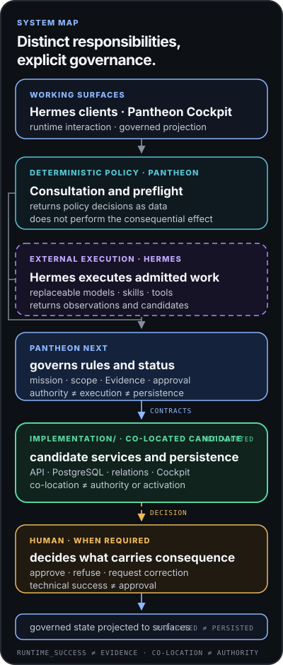

# Pantheon Next

> Canonical governance repository for AI-assisted professional work.

[Français](README.fr.md) · [Public site](https://ifanjuang.github.io/Pantheon-Next/) · [Status](docs/governance/STATUS.md) · [What runs](docs/governance/WHAT_RUNS.md) · [Governance index](docs/governance/README.md) · [Contributing](CONTRIBUTING.md)

Pantheon Next owns the doctrine, schemas, statuses and gates used to qualify consequential professional work. It governs provenance, Evidence, scope, approvals, claims, ChangeCandidates and Capability Slots.

It is not an agent runtime, scheduler, queue, provider router, installer, plugin manager, memory engine or automatic approval system.

The repository is also the monorepo host for a bounded executable candidate implementation under `implementation/`. Repository co-location does not transfer governance authority to that code.

## System boundary

| Component | Responsibility |
|---|---|
| **Pantheon Next governance surfaces** | Governance, doctrine, schemas, status and authorization boundaries. |
| **[`implementation/`](implementation/)** | Bounded candidate implementation: PostgreSQL, APIs, Cockpit projections and adapters; imported from the former `pantheon-mvp` repository. |
| **Hermes** | External task execution, skills, tools and runtime bindings. |
| **Cockpit / OpenWebUI** | User interaction and decision projections. UI state is not authorization. |
| **Human** | Consequential review, approval, rejection and signature. |

```text
Pantheon governs.
Executable implementation remains bounded.
External runtimes execute.
The human decides what is consequential.
```



The direct path does not require Hermes. The assisted path produces observations or candidates; it does not approve them. See the [public landing page](https://ifanjuang.github.io/Pantheon-Next/) for the authority chain and runtime-status honesty map.

## Repository status

Pantheon Next is canonical but still partial. The repository contains governance doctrine, declarative schemas, validation tests, static documentation, a bounded read-only policy/verification package and a separately bounded candidate implementation subtree.

Before relying on an implementation claim, read:

1. [`STATUS.md`](docs/governance/STATUS.md) — current posture and active exceptions.
2. [`WHAT_RUNS.md`](docs/governance/WHAT_RUNS.md) — what runs, what is static, partial or absent.
3. [`AUTHORITY_INDEX.md`](docs/governance/AUTHORITY_INDEX.md) — authority classes and promotion rules.
4. [`MODULES.md`](docs/governance/MODULES.md) — ownership and runtime boundaries by area.

## Development

The repository root is a governance and documentation workspace. It is intentionally **not** an installable Python package.

```bash
python3 -m venv .venv
source .venv/bin/activate
python -m pip install -r requirements-dev.txt
python -m pytest -q
```

`mcp-server/` remains the bounded governance-side Python distribution:

```bash
python -m pip install "mcp-server/.[test]"
python -m unittest discover -s mcp-server/tests -v
```

`implementation/` is a separate Python project containing the executable candidate implementation imported from `pantheon-mvp`:

```bash
python -m pip install -e "implementation[test]"
```

The two project boundaries do not make the repository root distributable and do not collapse governance into execution.

`VERSION` is the governance repository checkpoint version. `CHANGELOG.md`, `mcp-server/` package metadata and release tags must remain aligned unless a reviewed release contract states otherwise.

## Repository map

| Path | Purpose |
|---|---|
| [`docs/governance/`](docs/governance/) | Canonical doctrine, authority, status and boundaries. |
| [`schemas/`](schemas/) | Governed structural contracts. |
| [`tests/`](tests/) | Repository validation and consistency checks. |
| [`mcp-server/`](mcp-server/) | Read-only policy and verification projections. |
| [`implementation/`](implementation/) | Executable candidate implementation; co-located but not a governance authority. |
| [`hermes/profiles/`](hermes/profiles/) | Candidate Hermes profile templates; not installed runtime. |
| [`docs/assets/`](docs/assets/) | Static pages and prototypes; not product availability. |
| [`ai_logs/`](ai_logs/) | Intervention trace; not doctrine. |

## Contribution rules

Before significant work, read the active repository documents and open PRs. The repository overrides older prompts and historical plans.

Minimum read path:

```text
docs/governance/STATUS.md
docs/governance/WHAT_RUNS.md
docs/governance/AUTHORITY_INDEX.md
docs/governance/MODULES.md
docs/governance/README.md
CONTRIBUTING.md
```

Changes to schemas, tests, CI, Docker, operations, platform, `mcp-server/` or `implementation/` require protected review. A candidate becomes authoritative only through explicit promotion with a referenced schema, test, verified observation or dated human decision.

## Invariants

```text
installed != approved
healthy != safe
runtime_success != Evidence
retrieved != truth
binding_selected != dependency_adopted
activated != task_authorized
UI status != authorization
repository co-location != authority transfer
```

## License

MIT — see [`LICENSE`](LICENSE).

Copyright © 2026 IFJ Architecture.
