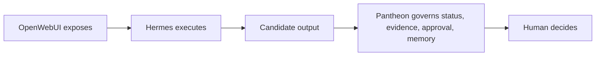

# Pantheon Next

> Governance kernel for AI-assisted professional work.

[French version](README.fr.md) · [Public page](https://ifanjuang.github.io/Pantheon-Next/) · [Professional introduction](docs/intro-professionnelle.md) · [Governance index](docs/governance/README.md) · [Contributing](CONTRIBUTING.md)

Pantheon Next is a governance-first repository. It defines how consequential AI work is framed, reviewed, evidenced, approved, remembered and exposed to humans.

It is not an AI engine, an agent runtime, a scheduler, a queue, a provider router, a plugin manager, an installer, a memory backend or an automatic approval system.

```text
OpenWebUI exposes.
Hermes Agent executes.
Pantheon Next governs.
```

## Read this first

- To understand the project, read this README.
- To know what is actually implemented, read [`docs/governance/WHAT_RUNS.md`](docs/governance/WHAT_RUNS.md).
- To know what is authoritative, read [`docs/governance/AUTHORITY_INDEX.md`](docs/governance/AUTHORITY_INDEX.md).
- To work on the repository, read [`docs/governance/README.md`](docs/governance/README.md) and [`CONTRIBUTING.md`](CONTRIBUTING.md).

## Current status

Pantheon Next is partial but structurally coherent.

It currently contains:

- governance doctrine and support indexes;
- static GitHub Pages documentation and prototypes;
- candidate domain, workflow, card and capability models;
- validation and status artifacts, including a bounded read-only MCP policy surface, still partial / to verify.

It does not currently provide:

- an internal execution runtime;
- an autonomous agent loop;
- automatic approval;
- automatic memory promotion;
- provider routing, scheduling, queueing, installation or update execution.

If a page, prototype, diagram or asset appears to imply runtime behavior, [`docs/governance/WHAT_RUNS.md`](docs/governance/WHAT_RUNS.md) wins.

Repository truth is read in this order:

1. [`docs/governance/STATUS.md`](docs/governance/STATUS.md) — current posture and live exceptions.
2. [`docs/governance/WHAT_RUNS.md`](docs/governance/WHAT_RUNS.md) — what runs, what is static, what is partial, what is absent.
3. [`docs/governance/AUTHORITY_INDEX.md`](docs/governance/AUTHORITY_INDEX.md) — authority classes and promotion rules.
4. [`docs/governance/MODULES.md`](docs/governance/MODULES.md) — governance areas and runtime boundaries.

## Why it exists

AI output in professional work is not just text. It can become a false truth, a wrong memory, an unapproved external effect, an invalid approval, or a responsibility-bearing commitment.

Pantheon Next gives those moments a visible governance path:

```text
what may enter
what may be exposed
what needs evidence
what needs approval
what may remain
```

The tool may propose. The professional decides.

## Division of labor

| Layer | Role | Boundary |
|---|---|---|
| OpenWebUI | Exposes the cockpit, dossier view, statuses and decision surfaces. | Does not govern or execute. |
| Hermes Agent | Executes tasks externally under contract: extraction, comparison, drafting, tool calls, candidate production. | Does not self-approve, canonize truth or promote memory. |
| Pantheon Next | Governs status, evidence, approval, scope, memory and external-action boundaries. | Does not become the runtime. |
| Human | Reviews, validates, rejects, authorizes or signs. | Final responsibility remains visible. |

Conceptual governance path, not runtime topology:



## Core distinctions

```text
installed        ≠ approved
healthy          ≠ safe
update_available ≠ update_authorized
runtime_success  ≠ evidence
binding_selected ≠ dependency_adopted
watchlist_item   ≠ install_instruction
```

These distinctions apply to every capability, skill, connector, workflow, model, runtime and external repository considered by Pantheon Next.

## Repository map

| Area | Purpose |
|---|---|
| [`docs/governance/`](docs/governance/) | Doctrine, status, authority, modules, approvals, evidence, memory and integration boundaries. |
| [`docs/examples/`](docs/examples/) | Fictional professional examples. Useful for method review, not legal or technical advice. |
| [`docs/assets/`](docs/assets/) | Static pages, diagrams and prototypes. Static publication is not product availability. |
| [`hermes/profiles/`](hermes/profiles/) | Lightweight Hermes profile templates. Candidate templates, not installed execution. |
| [`schemas/`](schemas/) | Validation contracts. Protected review required. |
| [`tests/`](tests/) | Validation checks where present. Tests do not promote doctrine by themselves. |
| [`mcp-server/`](mcp-server/) | Bounded read-only policy / verification surface. Partial, protected, to verify. |
| [`ai_logs/`](ai_logs/) | Intervention trace. Logs are not doctrine. |

## Reviewing an external capability

For any external repo, runtime, skill, connector or workflow, classify the slot before adoption:

```text
abstract capability
→ candidate Hermes binding
→ installation status
→ health status
→ update status
→ activation status
→ Pantheon gates
→ human approval
```

Before adopting a capability, answer:

1. What consequence can it produce?
2. What executes it?
3. What does Pantheon govern?
4. What evidence is required?
5. What human approval is needed?
6. What must remain forbidden?

Pantheon may govern a control plane. It may display, qualify, trace and gate the state of an external runtime. It must not silently become that runtime.

## Working on the repository

Before significant work, read the active repository documents. The repo overrides older prompts, comments and historical plans.

Minimum check:

```text
docs/governance/STATUS.md
docs/governance/WHAT_RUNS.md
docs/governance/AUTHORITY_INDEX.md
docs/governance/MODULES.md
docs/governance/README.md
CONTRIBUTING.md
```

Use explicit status language:

```text
implemented
documented non-implemented
partial / to verify
candidate only
obsolete / refused
not applicable
```

A candidate does not become doctrine by age, repetition or usefulness. Promotion requires an explicit referent: schema, test, running example, read-only verification surface, or dated human decision in `ai_logs/`.

## License

MIT — see [`LICENSE`](LICENSE).

Copyright © 2026 IFJ Architecture.
