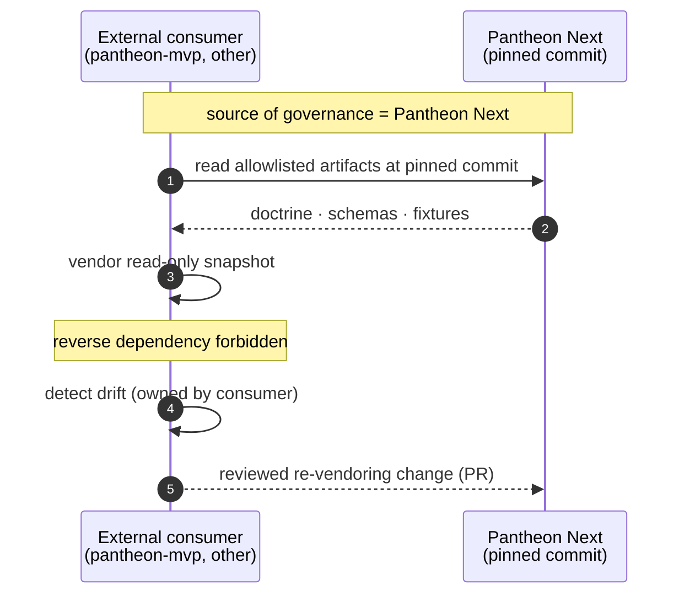

# Pantheon Next

> Canonical governance repository for AI-assisted professional work.

[Français](README.fr.md) · [Public site](https://ifanjuang.github.io/Pantheon-Next/) · [Status](docs/governance/STATUS.md) · [What runs](docs/governance/WHAT_RUNS.md) · [Governance index](docs/governance/README.md) · [Contributing](CONTRIBUTING.md)

Pantheon Next owns the doctrine, schemas, statuses and gates used to qualify consequential professional work. It governs provenance, Evidence, scope, approvals, claims, ChangeCandidates and Capability Slots.

It is not an agent runtime, scheduler, queue, provider router, installer, plugin manager, memory engine or automatic approval system.

## System boundary

| Component | Responsibility |
|---|---|
| **Pantheon Next** | Governance, doctrine, schemas, status and authorization boundaries. |
| **[pantheon-mvp](https://github.com/ifanjuang/pantheon-mvp)** | External candidate implementation: PostgreSQL, APIs, Cockpit projections and adapters. |
| **Hermes** | External task execution, skills, tools and runtime bindings. |
| **Cockpit / OpenWebUI** | User interaction and decision projections. UI state is not authorization. |
| **Human** | Consequential review, approval, rejection and signature. |

```text
Pantheon governs.
External runtimes execute.
The human decides what is consequential.
```


The direct path does not require Hermes. The assisted path produces observations or candidates; it does not approve them. See the [public landing page](https://ifanjuang.github.io/Pantheon-Next/) for the authority chain and runtime-status honesty map.

## Repository status

Pantheon Next is canonical but still partial. The repository contains governance doctrine, declarative schemas, validation tests, static documentation and a bounded read-only policy/verification package.

Before relying on an implementation claim, read:

1. [`STATUS.md`](docs/governance/STATUS.md) — current posture and active exceptions.
2. [`WHAT_RUNS.md`](docs/governance/WHAT_RUNS.md) — what runs, what is static, partial or absent.
3. [`AUTHORITY_INDEX.md`](docs/governance/AUTHORITY_INDEX.md) — authority classes and promotion rules.
4. [`MODULES.md`](docs/governance/MODULES.md) — ownership and runtime boundaries by area.

## Development

The repository root is a governance and documentation workspace. It is intentionally **not** an installable Python package.

```bash
python3 -m venv .venv
source .venv/bin/activate
python -m pip install -r requirements-dev.txt
python -m pytest -q
```

`mcp-server/` is the only Python distribution maintained in this repository:

```bash
python -m pip install "mcp-server/.[test]"
python -m unittest discover -s mcp-server/tests -v
```

`VERSION` is the repository checkpoint version. `CHANGELOG.md`, package metadata and release tags must remain aligned.

## Running the policy service

`mcp-server/` exposes one transport-neutral `PantheonPolicyService` with two read-only projections. Both return policy, validation and candidate data only; neither executes work, approves an effect or promotes memory.

**Local MCP (stdio)** — agent-native consultation, no network exposure:

```bash
PANTHEON_REPO_PATH="$PWD" python -m pantheon_mcp.server
```

Governed by `mcp-server/docs/CONSULTATION_CONTRACT.md`.

**Internal HTTP (`pantheon-policy-api`)** — deterministic preflight for external runtimes, hardened container, internal network only:

```bash
PANTHEON_POLICY_API_KEY="<shared-secret>" \
  docker compose -f compose.policy-api.yaml up --build
```

Governed by `mcp-server/docs/HTTP_API_CONTRACT.md`. The container mounts the repo read-only, drops all capabilities, has no host port and joins the `ai-net` network.

Minimal preflight call:

```bash
curl -sS \
  -H "Authorization: Bearer $PANTHEON_POLICY_API_KEY" \
  -H "Content-Type: application/json" \
  http://pantheon-policy-api:8000/policy/preflights:evaluate \
  -d '{
    "request": {
      "intent": "draft_client_reply",
      "external_effect": true,
      "writes_state": false,
      "transmission_requested": true,
      "memory_promotion_requested": false
    },
    "gate_signals": {}
  }'
```

The response always sets `external_effect_allowed: false` and `authorization_effect: none`. The enforcement point is the external runtime, not the policy service.

## Repository map

| Path | Purpose |
|---|---|
| [`docs/governance/`](docs/governance/) | Canonical doctrine, authority, status and boundaries. |
| [`schemas/`](schemas/) | Governed structural contracts. |
| [`tests/`](tests/) | Repository validation and consistency checks. |
| [`mcp-server/`](mcp-server/) | Read-only policy and verification projections. |
| [`hermes/profiles/`](hermes/profiles/) | Candidate Hermes profile templates; not installed runtime. |
| [`docs/assets/`](docs/assets/) | Static pages and prototypes; not product availability. |
| [`ai_logs/`](ai_logs/) | Intervention trace; not doctrine. |

## Contribution rules

Before significant work, read the active repository documents and open PRs. The repository overrides older prompts and historical plans.

Minimum read path:

```text
docs/governance/STATUS.md
docs/governance/WHAT_RUNS.md
docs/governance/AUTHORITY_INDEX.md
docs/governance/MODULES.md
docs/governance/README.md
CONTRIBUTING.md
```

Changes to schemas, tests, CI, Docker, operations, platform or `mcp-server/` require protected review. A candidate becomes authoritative only through explicit promotion with a referenced schema, test, verified observation or dated human decision.

## Consumer integration

An external consumer (for example [`pantheon-mvp`](https://github.com/ifanjuang/pantheon-mvp)) reads a bounded subset of Pantheon Next artifacts as a read-only vendored snapshot pinned to an exact commit. The reverse direction is forbidden. Drift detection is owned by the consumer; corrections take the form of a reviewed re-vendoring change.



Full rule: [`NEXT_MVP_REPOSITORY_PLACEMENT.md`](docs/governance/NEXT_MVP_REPOSITORY_PLACEMENT.md). Enforcement seam: [`BRIDGE_CONTRACT.md`](docs/governance/BRIDGE_CONTRACT.md).

## Invariants

```text
installed != approved
healthy != safe
runtime_success != Evidence
retrieved != truth
binding_selected != dependency_adopted
activated != task_authorized
UI status != authorization
```

## License

MIT — see [`LICENSE`](LICENSE).

Copyright © 2026 IFJ Architecture.
