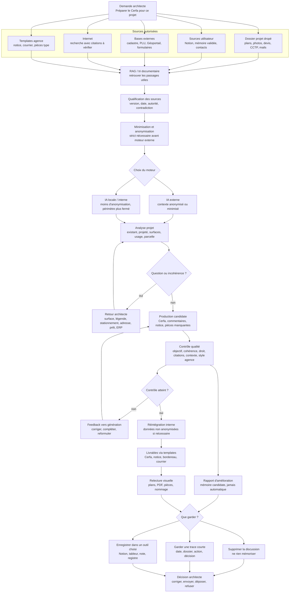

# Exemple — Conduire un dossier Cerfa avec IA, RAG, contrôles et retours utilisateur

Status: fictional professional example — documented, non-implemented.

Cet exemple décrit un workflow possible pour une agence d’architecture. Il ne décrit pas une fonctionnalité opérationnelle disponible aujourd’hui. Il sert à montrer comment Pantheon pourrait cadrer un travail assisté par IA sans transformer l’IA en autorité, en mémoire automatique ou en action externe non validée.

## Situation

Demande utilisateur :

```text
Prépare le Cerfa pour ce projet.
```

Le système ne remplit pas simplement un formulaire. Il conduit un dossier : il rassemble les sources, vérifie leur statut, extrait le contexte nécessaire, choisit le niveau d’exposition acceptable, produit un candidat, contrôle la qualité, revient vers l’architecte quand quelque chose manque ou semble incohérent, puis prépare les livrables pour relecture.

## Graphe simplifié



## Ce que le graphe montre

### 1. Les sources ne sont pas toutes du même niveau

Le workflow distingue :

- le dossier spécifique au projet : plans, photos, CCTP, devis, comptes rendus, mails, pièces déposées ;
- les sources utilisateur : Notion, mémoire validée, contacts, anciens modèles, registres internes ;
- les bases externes : cadastre, PLU, Géoportail de l’urbanisme, formulaires officiels ;
- les sources internet : utiles pour chercher, mais à citer et vérifier ;
- les templates agence : formes de livrables, jamais preuves.

Une source trouvée ne devient pas une preuve par elle-même. Elle devient un élément candidat à qualifier.

### 2. Le RAG aide à chercher, mais ne décide pas

Le RAG consiste à retrouver les passages utiles avant d’interroger le moteur. Il réduit l’exposition du dossier et permet de rattacher une réponse à des extraits.

Mais il ne suffit pas. Une recherche peut retrouver une ancienne version de PLU, une page hors contexte, un document projet obsolète ou une citation qui ne dit pas exactement ce que le résumé prétend.

Pantheon doit donc exiger :

- une source ;
- une date ;
- une version ;
- une citation vérifiable ;
- une contradiction visible si deux sources divergent ;
- un statut de sortie : brouillon, candidat, à vérifier, prêt pour relecture.

### 3. Les données sont triées avant moteur externe

Avant tout appel à une IA externe, le contexte est minimisé : seules les informations nécessaires à la tâche partent.

Exemples :

- remplacer le nom du client par `MOA_01` ;
- masquer une adresse personnelle si elle n’est pas nécessaire ;
- ne transmettre qu’un extrait de plan ou de notice ;
- exclure les pièces financières si elles ne servent pas à remplir le formulaire ;
- garder les photos de chantier en interne si elles contiennent des éléments sensibles.

Si le travail nécessite des données non anonymisées, le workflow peut proposer une IA locale ou une exécution interne. Ce choix reste visible.

### 4. Le système sait s’arrêter

Le workflow doit poser des questions au lieu de compléter à l’aveugle.

Exemples de questions :

- Je trouve deux adresses pour le maître d’ouvrage. Laquelle faut-il utiliser ?
- Le projet bénéficie-t-il d’un prêt spécifique à déclarer ?
- La surface indiquée au plan ne correspond pas à mon calcul. Faut-il retenir la surface du plan ou marquer un point à vérifier ?
- Le plan ne montre pas de stationnement alors que le règlement semble en exiger. Est-ce normal ?
- La légende ne distingue pas clairement l’existant conservé et le projeté. Faut-il corriger la pièce graphique ?
- L’usage et les surfaces suggèrent peut-être un ERP. Voulez-vous que je prépare aussi les pièces ERP associées ?
- Une dérogation semble possible ou nécessaire. Faut-il d’abord vérifier une solution conforme sans dérogation ?

### 5. Le contrôle qualité intervient avant livrable

Le résultat candidat doit passer une grille de contrôle :

- l’objectif initial est-il atteint ?
- les champs du formulaire sont-ils complets ou marqués à confirmer ?
- les citations existent-elles réellement ?
- le texte respecte-t-il le contexte du projet ?
- les surfaces sont-elles cohérentes avec les plans ?
- les pièces graphiques se contredisent-elles ?
- le vocabulaire respecte-t-il la méthode de l’agence ?
- les commentaires indiquent-ils les incertitudes ?
- le livrable engage-t-il l’agence ?

Si le contrôle échoue, le résultat repart en génération ou en correction. Ce retour n’est pas un échec : c’est la boucle normale du dossier.

### 6. Le livrable reste candidat jusqu’à décision

Le workflow peut préparer :

- un Cerfa prérempli ;
- une notice candidate ;
- un bordereau des pièces ;
- une liste des pièces manquantes ;
- des commentaires de relecture ;
- une lettre d’accompagnement ;
- un brouillon de courrier ou de message prêt à relire.

Mais il ne dépose pas, ne signe pas et n’envoie pas seul.

La transmission reste une décision visible de l’architecte.

### 7. La trace elle-même est une décision

À la fin, le système doit demander quoi faire des traces produites pendant la discussion.

Exemples :

```text
Souhaitez-vous conserver une trace de cette préparation ?
```

Options possibles :

- supprimer la discussion ou ne rien promouvoir en mémoire ;
- garder une trace minimale : dossier, action, date, statut, décision ;
- enregistrer une ligne de suivi dans Notion ;
- enregistrer une ligne dans un tableur ;
- créer une note courte dans l’outil de suivi choisi ;
- conserver un rapport d’amélioration comme mémoire candidate, à valider avant réutilisation.

Exemple de trace minimale :

```text
Projet : X
Action : Cerfa préparé en version candidate
Date de préparation : AAAA-MM-JJ
Date de transmission prévue ou effective : à renseigner
Statut : à relire
Points ouverts : stationnement, surface, ERP, notice
Décision : non déposé
```

Aucune mémoire durable ne doit être créée sans validation.

## Risques IA couverts par ce workflow

- hallucination : réponse fausse mais plausible ;
- citation inventée ou citation qui ne prouve pas l’affirmation ;
- RAG hors contexte : bon passage retrouvé, mauvaise interprétation ;
- source périmée : ancien PLU, ancien formulaire, ancienne pièce projet ;
- contradiction lissée : deux pièces divergent mais la réponse les fusionne ;
- surconfiance : texte fluide qui masque un doute ;
- exposition excessive : trop de données client envoyées à un moteur externe ;
- instruction cachée dans une source : page, PDF ou mail traité comme consigne ;
- automatisation trop forte : brouillon traité comme envoi, candidat traité comme validé ;
- mémoire dérivante : une information de projet devient une vérité générale.

## Boundary

Ce workflow illustre la doctrine :

```text
The database records.
The workflow proposes.
The evidence supports.
The approval validates.
The human decides.
```

État repo : documenté, non implémenté.
