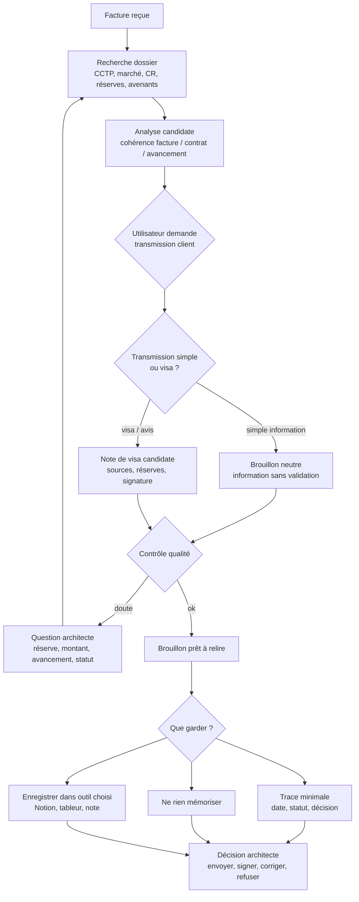

# Exemple — Facture, CCTP, dernier CR et risque de visa implicite

Status: fictional professional example — documented, non-implemented.

Cet exemple décrit un workflow possible en agence d’architecture lorsqu’une entreprise transmet une facture ou une situation, et que l’architecte demande à l’IA de l’analyser puis de préparer une réponse au client.

Le point critique : un message apparemment simple peut devenir un visa, une validation ou une recommandation de paiement. Pantheon doit donc distinguer l’information, l’avis technique, le visa, la transmission et la signature.

Voir aussi le prototype D3 : [`architecture_invoice_visa_spine_d3.html`](../../assets/pantheon-workflows/architecture_invoice_visa_spine_d3.html).

## Situation

L’utilisateur reçoit une facture d’entreprise dans le dossier projet.

Demande utilisateur :

```text
Analyse cette facture par rapport au CCTP et au dernier compte rendu.
```

Le système cherche dans les sources autorisées :

- la facture reçue ;
- le CCTP du lot concerné ;
- le marché ou devis signé ;
- le dernier compte rendu de chantier ;
- les réserves ou observations encore ouvertes ;
- les situations précédentes ;
- les éventuels avenants ;
- les mails récents liés au poste facturé.

## Premier retour candidat

Le système ne dit pas simplement : “c’est bon”.

Il produit un retour qualifié :

```text
Analyse candidate.

La facture semble cohérente avec le poste prévu au CCTP et avec l’avancement mentionné dans le dernier compte rendu.

Sources utilisées :
- CCTP lot X, article Y ;
- devis / marché signé du JJ/MM/AAAA ;
- dernier CR de chantier n°Z, section avancement ;
- facture entreprise du JJ/MM/AAAA.

Points à vérifier :
- aucune réserve ouverte identifiée sur ce poste dans le dernier CR ;
- aucun avenant trouvé concernant ce poste ;
- montant cohérent avec le marché, sous réserve de votre validation.

Statut : candidat à relecture.
```

## Demande utilisateur

L’utilisateur répond :

```text
Ok, transmets au client.
```

Pantheon ne doit pas envoyer directement.

Il doit d’abord demander ce que signifie “transmettre”.

## Gate : information simple ou visa ?

Question posée à l’utilisateur :

```text
Souhaitez-vous une simple transmission d’information au client, ou un visa / avis de validation sur la facture ?

- Transmission simple : je prépare un mail indiquant que la facture a été reçue et qu’elle est transmise pour information, sans recommandation de paiement.
- Visa / avis : je prépare une note de visa avec sources, réserves éventuelles et rappel de votre engagement. Cette note devra être relue et signée par vous avant envoi.
```

## Cas 1 — simple transmission

Si l’utilisateur choisit une simple transmission, le système prépare un brouillon neutre.

```text
Objet : Transmission facture entreprise — Projet X

Bonjour,

Nous vous transmettons ci-joint la facture reçue de l’entreprise [ENTREPRISE] concernant le lot [LOT].

Cette transmission est faite pour information et relecture de votre part. Elle ne vaut pas validation définitive ni ordre de paiement à ce stade.

Nous revenons vers vous après vérification complète si un point particulier doit être signalé.

Bien cordialement,
```

Statut : brouillon, non envoyé.

Le système peut proposer :

```text
Voulez-vous que je crée un brouillon Gmail avec ce texte et la facture jointe, ou préférez-vous copier le texte manuellement ?
```

## Cas 2 — visa ou avis de validation

Si l’utilisateur choisit un visa, le système change de niveau de contrôle.

Il prépare une note PDF candidate, pas seulement un mail.

La note peut contenir :

- projet ;
- entreprise ;
- lot concerné ;
- facture ou situation analysée ;
- documents examinés ;
- rapprochement avec le CCTP ;
- rapprochement avec le dernier compte rendu ;
- réserves éventuelles ;
- points non vérifiés ;
- avis candidat ;
- champ de signature architecte ;
- date ;
- statut : “à relire et signer”.

Exemple de rappel :

```text
Cette note constitue un avis candidat de visa. Elle peut engager l’agence si elle est transmise comme validation. Elle doit être relue, datée et signée par l’architecte avant envoi au client.
```

## Gate : signature et engagement

Avant de préparer l’envoi, Pantheon demande :

```text
Confirmez-vous vouloir émettre un visa sur cette facture ?

Je peux préparer :
- la note PDF candidate ;
- le mail d’accompagnement ;
- la liste des sources utilisées ;
- les réserves éventuelles ;
- une mention indiquant que le paiement reste une décision du maître d’ouvrage.

La signature et l’envoi restent à votre validation.
```

## Contrôles avant brouillon final

Avant tout brouillon prêt à envoyer, le système vérifie :

- la facture correspond-elle au bon projet ?
- le lot facturé existe-t-il dans le marché ?
- le montant correspond-il au devis, marché ou avenant ?
- le dernier CR indique-t-il un avancement compatible ?
- une réserve ouverte contredit-elle le paiement ?
- une retenue, pénalité, situation antérieure ou acompte existe-t-il ?
- le message final est-il une simple transmission ou un visa ?
- le statut est-il visible ?
- le document doit-il être signé ?
- faut-il conserver une trace de la date de transmission ?

## Après préparation : que garder ?

Une fois le brouillon ou la note candidate préparés, le système demande quoi conserver.

```text
Souhaitez-vous garder une trace de cette transmission ?
```

Options :

- ne rien mémoriser ;
- conserver uniquement la date et le statut ;
- ajouter une ligne dans Notion ;
- ajouter une ligne dans un tableur de suivi ;
- créer une note courte dans l’outil choisi ;
- conserver le rapport de vérification comme mémoire candidate.

Exemple de trace minimale :

```text
Projet : X
Entreprise : Y
Document : facture n°...
Action : brouillon client préparé
Statut : transmission simple / visa candidat
Date de préparation : AAAA-MM-JJ
Date d’envoi : à renseigner après validation
Sources : CCTP, marché, dernier CR
Décision : non envoyé / envoyé après validation
```

## Graphe simplifié



## Ce que Pantheon évite

- transformer une analyse candidate en validation ;
- envoyer un mail qui recommande implicitement le paiement ;
- oublier une réserve ouverte dans le dernier CR ;
- ignorer un avenant ou une situation précédente ;
- confondre transmission d’information et visa ;
- produire une note engageante sans signature ;
- mémoriser une décision sans validation ;
- perdre la date de transmission.

## Boundary

Le workflow propose. Les sources appuient. Le visa engage seulement si l’architecte le valide, le signe et décide de le transmettre.

État repo : documenté, non implémenté.
