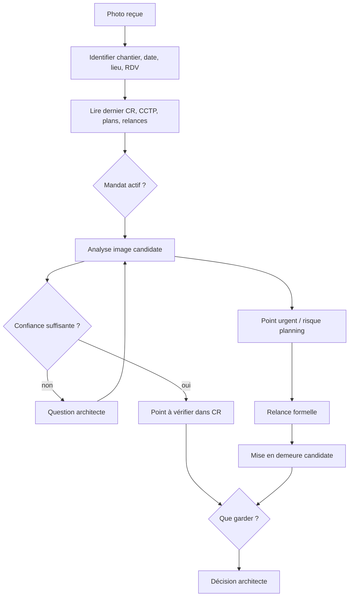

# Exemple — Photo de chantier, indice visuel et décision tracée

Status: fictional professional example — documented, non-implemented.

Cet exemple décrit un workflow possible lorsqu’un architecte reçoit une photo de chantier par messagerie instantanée et souhaite l’exploiter sans transformer l’IA en contrôleur technique, en maître d’œuvre autonome ou en autorité juridique.

Le point critique : une photo peut révéler un indice utile, mais elle ne suffit pas toujours à établir une non-conformité. Pantheon doit donc distinguer l’indice visuel, le doute technique, le constat confirmé, l’inscription au compte rendu, la relance, l’alerte planning et la mise en demeure candidate.

Voir aussi le prototype D3 : [`architecture_site_photo_review_spine_d3.html`](../../assets/pantheon-workflows/architecture_site_photo_review_spine_d3.html).

## Situation

L’utilisateur transmet une photo de chantier par Telegram, WhatsApp ou mail.

Demande utilisateur :

```text
Analyse cette photo et dis-moi s’il faut l’ajouter au compte rendu.
```

Le système ne conclut pas directement. Il conduit une vérification.

## Sources recherchées

Le système tente de rattacher la photo à un contexte :

- chantier probable ;
- date et heure de réception ;
- métadonnées disponibles ou absentes ;
- position GPS si disponible et fiable ;
- rendez-vous chantier correspondant ;
- dernier compte rendu ;
- points déjà signalés ;
- relances antérieures ;
- lot concerné ;
- CCTP du lot ;
- détails projet ;
- plans cotés ;
- planning des lots à venir ;
- photos précédentes.

## Gate de mandat

Avant de qualifier le point, le système demande ou vérifie le mandat actif.

```text
Quel est le cadre de mission pour ce dossier : OPC seul, DET, VISA, AOR ou mission complète ?
```

- En DET ou mission complète, l’alerte peut être formulée comme point technique à vérifier, réserve potentielle ou non-conformité candidate selon le niveau de preuve.
- En OPC seul, l’alerte doit rester centrée sur la coordination et le risque de blocage : interface non levée, délai, lot empêché, information à transmettre à la maîtrise d’œuvre ou à l’entreprise.

Le système ne doit pas qualifier définitivement une non-conformité si le mandat ne l’autorise pas ou si la preuve est insuffisante.

## Analyse image

Le système décrit la photo avec statut :

```text
Description visuelle candidate, à confirmer.
```

Il peut repérer :

- un appui de fenêtre possiblement trop bas ;
- une réservation absente ;
- un seuil non conforme au détail projet ;
- un point déjà signalé encore présent ;
- une interface bloquante pour un autre lot ;
- une incohérence entre image, plan et CCTP.

Toute mesure issue de l’image est qualifiée :

```text
Mesure estimative sur photo, à confirmer sur site ou par plan coté.
```

## Exemple de retour prudent

```text
La photo semble concerner la baie B03 en façade nord, lot menuiseries extérieures / maçonnerie à confirmer.

Un doute est identifié sur la hauteur disponible de l’appui. La mesure issue de l’image est incertaine à cause de la perspective. Le point semble à rapprocher du détail projet D-04, du CCTP lot maçonnerie article X et du CCTP lot menuiseries article Y.

Statut proposé : point à vérifier avant inscription comme non-conformité.
```

Question posée :

```text
Souhaitez-vous :
1. demander une photo cotée ou une vérification sur site ;
2. inscrire le point au compte rendu comme “à vérifier” ;
3. le passer en alerte technique si vous confirmez le constat ?
```

## Point déjà relancé

Si un autre détail visible au second plan correspond à un point déjà signalé plusieurs fois, le système change de niveau.

Exemple :

```text
Un second point visible au fond de l’image semble correspondre au défaut déjà mentionné aux CR n°08, n°09 et n°10.

Ce point semble toujours non levé malgré trois relances et un avertissement. Le lot suivant doit démarrer dans moins de deux semaines. Le sujet peut devenir bloquant.

Souhaitez-vous passer ce point en statut urgent dans le compte rendu et préparer une relance formelle ?
```

## Escalade graduée

Le workflow doit éviter de proposer directement une mise en demeure comme action normale.

Ordre prudent :

1. point à vérifier ;
2. observation au compte rendu ;
3. demande de confirmation à l’entreprise ;
4. relance formelle ;
5. alerte planning / interface bloquante ;
6. projet de courrier recommandé ;
7. mise en demeure candidate à valider contractuellement avant envoi.

La mise en demeure reste un document candidat. Elle ne doit jamais être générée comme acte automatique.

## Formulation candidate pour compte rendu

```text
Point à vérifier — appui de fenêtre / baie [référence]

À partir de la photo transmise le [date] et rattachée au chantier [projet], un doute est identifié concernant la hauteur / géométrie de l’appui de fenêtre de la baie [référence]. Ce point est à vérifier sur site ou sur plan coté. Il est susceptible de concerner le lot [lot] au regard du CCTP [référence] et du détail projet [référence]. L’entreprise est invitée à confirmer la conformité de l’exécution ou à proposer une correction.
```

## Formulation candidate pour point urgent

```text
Point urgent — relance n°4 / risque planning

Le point signalé aux CR n°[x], [y] et [z] semble toujours non levé sur la photo transmise le [date]. Ce maintien est susceptible de bloquer l’intervention du lot [lot suivant] prévue à partir du [date]. Le point est passé en statut urgent. L’entreprise [nom] est invitée à intervenir ou à transmettre une date ferme de reprise avant le [date]. À défaut, un courrier formel pourra être proposé au maître d’ouvrage.
```

## Brouillons possibles

Le système peut préparer :

- un extrait de compte rendu ;
- une annotation sur photo ;
- une demande de photo cotée ;
- une relance entreprise ;
- une alerte au maître d’ouvrage ;
- un projet de mise en demeure candidate ;
- une ligne de suivi dans Notion, tableur ou registre ;
- une mémoire candidate limitée au dossier.

Aucun message n’est envoyé seul.

## Graphe simplifié



## Risques IA couverts

- photo mal localisée ;
- métadonnées absentes ou altérées ;
- mesure fausse à cause de la perspective ;
- confusion de baie, niveau ou façade ;
- confusion de lot ;
- confusion entre défaut, réserve, non-façon et non-conformité ;
- DTU mal appliqué ;
- CCTP mal cité ;
- dernier compte rendu non pris en compte ;
- point déjà levé mais mémoire non mise à jour ;
- mission OPC dépassée par une qualification technique ;
- mise en demeure proposée trop tôt ;
- courrier engageant envoyé sans validation.

## Boundary

L’IA ne constate pas à la place de l’architecte. Elle rapproche, alerte, qualifie, demande confirmation et prépare les suites.

Le workflow propose. Les sources appuient. L’approbation valide. L’humain décide.

État repo : documenté, non implémenté.
