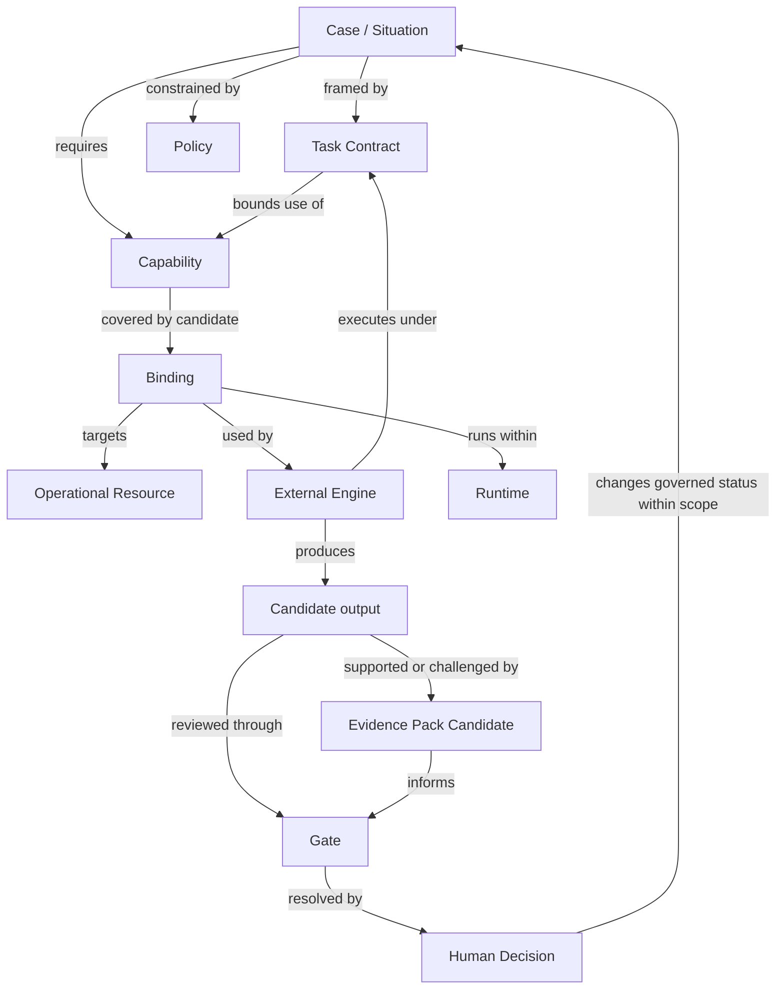

# Governance Object Relationship Map

Status: candidate support doctrine — documented non-implemented.
Boundary profile: candidate_support_note.

This document maps relationships between governance objects already defined elsewhere. It does not own those objects and does not replace their authoritative documents.

## Purpose

The map answers one question:

```text
How do Pantheon governance objects relate without turning Pantheon into the engine?
```

It is an explanatory map, not a runtime topology, schema, workflow, universal ontology or competing doctrine source. If this map conflicts with an owner document, the owner document wins.

## Jurisdiction

```text
PANTHEON_GRAPH_MODEL
= generic grammar for governed nodes and relations

GOVERNANCE_OBJECT_RELATIONSHIP_MAP
= cross-domain responsibility and non-equivalence map

COMMON_INSTALLATION_BASELINE
= single required installation baseline

INSTALL_MODULE_CATALOG
= independent component records and lifecycle status
```

This map may reference, but does not own or redefine:

```text
Provisioner
InstallationCandidate
ProvisionerHandoffCandidate
HandoffDecision
ExecutionResultCandidate
HealthObservation
```

## Object families

### Case

A Case is the professional unit. Mission intent is a field of the Case, not a competing canonical object. A Case may contain Situations, Task Contracts, candidate outputs, Gates and Decisions.

### Task Contract

A Task Contract bounds external execution. It does not start execution, widen access or authorize an external effect by itself.

### Capability

A Capability is an abstract governable effect class. It does not name a product and does not execute.

### Binding

A Binding records a candidate implementation arrangement covering a Capability under a declared scope.

```text
binding_selected != dependency_adopted
binding_configured != binding_approved
binding_approved != action_authorized
```

### Operational Resource

`Operational Resource` is a local qualification used only in this map for a concrete external component, service, endpoint, store or dependency. It avoids collision with the competence-support meaning of `Resource` owned by `TERMINOLOGY_BOUNDARIES.md` and `COMPETENCE_MODEL.md`.

### External Engine

`External Engine` is a local relationship-map category, not a promoted kernel object. Hermes Agent occupies this execution role in the current architecture. Pantheon governs scope and consequence boundaries but does not perform the engine's reasoning loop, dispatch, retries, scheduling or queueing.

### Runtime

A Runtime is the operational environment in which an engine, connector or service executes. Pantheon may display, qualify, trace and gate a projection of runtime state. It does not install, update, restart, schedule or route the Runtime.

### Policy

A Policy constrains scope, data class, permitted effects, evidence, approval, memory, revocation and rollback expectations. A policy declaration does not enforce itself. Enforcement remains human or belongs to a separately approved external PDP/PEP implementation.

### Evidence

An external engine may return candidate outputs, source references, observations and Evidence Pack Candidates. Runtime success, logs and tool calls are not automatically evidence or validated truth.

### Gate and Decision

A Gate exposes a consequential threshold. A Human Decision resolves the Gate within a declared scope. Pantheon may qualify and record the Decision; it must not infer approval from runtime success, silence or UI interaction.

```text
approval != execution
approval != activation
decision_recorded != action_performed
```

## Relationship graph



These arrows are governance relations, not service calls, workflow steps or automatic transitions.

## Independent status axes

Pantheon must not collapse every object into one lifecycle or aggregate score. Keep at least these axes independent:

- governance maturity;
- operational posture;
- authorization posture;
- update posture;
- evidence posture.

## Responsibility allocation

| Concern | Pantheon governs | Hermes Agent executes | OpenWebUI exposes | Human decides |
|---|---|---|---|---|
| Case scope | scope, consequence, gate status | inside Task Contract | case and decision surfaces | consequential scope change |
| Capability | admissibility and limits | invokes permitted binding | capability posture | activation where required |
| Binding | admissibility, status, scope | uses external adapter | binding posture | adoption or activation where required |
| Runtime | status, gates, evidence expectations | runs externally | operational projection | install, update or activation where required |
| Evidence | criteria and review status | returns candidates | evidence review surface | sufficiency and reliance |
| External action | policy and Gate | performs only after authorization | decision surface | final authorization |
| Memory | promotion boundaries | may return candidates | memory status | durable promotion |

## Core non-equivalence rules

```text
installed != approved
healthy != safe
update_available != update_authorized
runtime_success != evidence
binding_selected != dependency_adopted
handoff_prepared != execution_authorized
execution_reported_success != installation_verified
installed != activated
```

Other non-equivalence rules remain owned by `NON_EQUIVALENCE_RULES.md` and domain-specific documents.

## Owner-document map

| Area | Owner document(s) |
|---|---|
| Case and controlled terminology | `TERMINOLOGY_BOUNDARIES.md`, `CORE_CONCEPTS_MAP.md` |
| Task Contract | `TASK_CONTRACTS.md` |
| Capability | `UNIFORM_CAPABILITY_GOVERNANCE.md`, `CAPABILITY_PLACEMENT.md` |
| Binding | `ADAPTERS_AND_BINDINGS.md` |
| Generic relation grammar | `PANTHEON_GRAPH_MODEL.md` |
| Common installation baseline | `COMMON_INSTALLATION_BASELINE.md` |
| Component records and installation preparation | `INSTALL_MODULE_CATALOG.md`, `COMMON_BASELINE_RUNBOOK.md` |
| Runtime posture | `PANTHEON_CONTROL_PLANE_BOUNDARY.md`, `PANTHEON_CONTROL_BOUNDARY.md` |
| Evidence | `EVIDENCE_PACK.md`, `EVIDENCE_TOPOLOGY.md` |
| Approval and Gates | `APPROVALS.md`, `USER_DECISION_GATE.md` |
| Memory | `MEMORY.md`, `SCOPE_ISOLATION.md` |
| Cockpit projection | `CARD_STACK_MODEL.md`, `DECISION_SURFACE_SPEC.md` |
| Roles | `AGENTS.md`, `GOVERNANCE_COLLEGE.md` |

## Two proof cases

### Professional Case

```text
Case
-> Task Contract
-> document.extract / document.compare Capability
-> Hermes Agent to Docling candidate Binding
-> original PDFs and derived extraction
-> Result Candidate + Evidence Pack Candidate
-> architect Gate
-> Human Decision
```

The originals remain superior to extraction, the runtime output remains candidate, and no durable memory is promoted automatically.

### External-runtime governance Case

A Docling sandbox installation can be framed as:

```text
Capability document_analysis
-> Operational Resource Docling
-> reviewed inline configuration
-> Binding Hermes Agent to Docling
-> Provisioner docker_compose
-> InstallationCandidate
-> ProvisionerHandoffCandidate
-> HandoffDecision bound to configuration_ref
-> ExecutionResultCandidate
-> HealthObservation
-> separate activation decision
```

The installation candidate carries the exact configuration under review. Pantheon does not become provisioner or runtime.

## Promotion condition

This document remains candidate support doctrine. Indexing or merging does not promote it. Any future promotion requires explicit human decision and confirmation that this map still adds explanatory value without duplicating owner doctrine.
