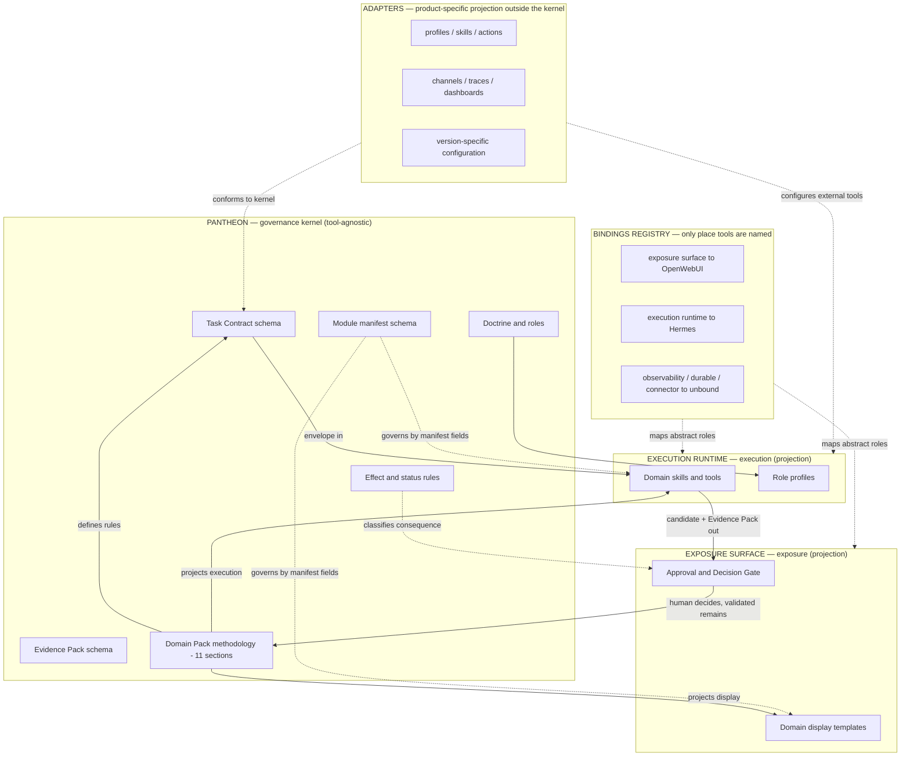

# Modular Domain Reorientation

Status: active support doctrine — tool-agnostic placement, modular capability contract and domain-pack projection model.

This document is a coordination artifact. It captures a reorientation so that parallel work — including ChatGPT-assisted development — stays aligned on one model.

It does not implement a runtime, a bridge, a plugin manager, a skill installer, a module registry runtime, a domain-pack worker, an OpenWebUI Function, a Hermes skill, an executable schema or any automatic approval or memory promotion.

```text
OpenWebUI exposes.
Hermes Agent executes.
Pantheon Next governs.
```

```text
This document governs placement orientation and cross-layer projection.
It does not replace MODULE_ACTIVATION.md, DOMAIN_PACK_SPEC.md, CAPABILITY_PLACEMENT.md or TASK_CONTRACTS.md.
It reconciles them under a single modular and domain placement model.
```

## Purpose

Pantheon Next is a method and governance framework, not a product runtime.

The deliverable is the set of rules, contracts, schemas and roles. It must survive the replacement of any single tool.

This reorientation answers three practical questions raised during review:

```text
What is interchangeable, and what is not?
Where does each capability live?
Where does a profession's methodology live?
```

## Reorientation summary

1. The framework body stays tool-agnostic. Product names live in one place only: the bindings registry.
2. Pantheon is not a funnel everything passes through. It attaches only at consequential decision points.
3. The non-negotiable prohibitions constrain the Pantheon repository, not the whole system. The execution runtime may be a runtime. The exposure surface may host plugins.
4. New capability is added by declaration, not by hardcoding. A conformant manifest plus the shared envelope makes a module drop in and stay governed.
5. A profession's methodology is defined once in Pantheon and projected into tool-specific surfaces. The rule never lives inside a tool.
6. Pantheon has a stable governance kernel and replaceable adapters. Tool releases are adapter events unless they reveal a missing tool-agnostic governance distinction.

## Doctrine, abstract form

```text
The exposure surface exposes.
The execution runtime executes.
Pantheon governs.
```

## Kernel and adapter split

Pantheon is divided conceptually into two layers:

```text
Governance kernel -> tool-agnostic rules that define legitimacy, truth status,
                     evidence, approval, memory, scope, action boundaries and
                     capability placement.

Adapters          -> tool-specific projections, bindings, prompts, profiles,
                     skills, channels, dashboards, traces and runtime settings.
```

The kernel is allowed to evolve during controlled bootstrap, because deployment has not stabilized yet. But a kernel change must satisfy a stricter test than an adapter update.

A rule belongs in the kernel only when it can be stated without naming a product and when it remains true if the exposure surface, execution runtime, observability layer, connector gateway or graph layer changes.

Examples of kernel rules:

```text
answering is not acting;
runtime success is not approval;
transport success is not task success;
retrieval is not proof;
trace is not Evidence Pack;
runtime memory is not canonical memory;
profile identity is not Pantheon Role authority;
plugin installed is not capability approved;
asynchronous execution does not change output status;
scheduled execution does not bypass scope, evidence or approval;
channel proximity does not imply approval.
```

Examples of adapter rules:

```text
which Hermes profile is selected;
which OpenWebUI action displays a gate;
which Langfuse metadata field carries a trace reference;
which messaging channel receives a draft;
which runtime feature performs background execution;
which skill implements extraction or image editing.
```

Tool-specific power is welcome. It must be expressed through adapters that depend on the kernel, not by embedding product behavior inside the kernel.

### Kernel-change test

Before changing the kernel, ask:

```text
Would this rule still be necessary if every current tool were replaced?
```

- Yes — it may be a kernel rule.
- No — it belongs in a binding, adapter, profile, skill, integration note or reference review.

During bootstrap, kernel changes are acceptable when they clarify durable governance. After deployment stabilization, the same changes should be treated as doctrine revisions requiring stricter review.

### Bindings registry

The only place where products are named. Changing a tool is a one-line change here, with no rewrite of the framework body.

| Abstract role | Current binding | Status |
|---|---|---|
| exposure surface | OpenWebUI | active |
| execution runtime | Hermes | active |
| observability | unbound | candidate — add only on real need |
| durable executor | unbound | candidate |
| deterministic preparation | script / skill | default |
| connector gateway | unbound | candidate |
| provenance graph | unbound | candidate |

Outside this registry, the framework body uses abstract role names only.

Exception — bindings and adapters documents. Dedicated integration and adapter documents may name products, because their subject *is* the binding to a specific tool. This exception covers the bindings registry above, `ADAPTERS_AND_BINDINGS.md`, tool-specific integration documents and the `reference_reviews/` integration notes. Everywhere else, the generic doctrine body stays abstract.

## Placement model

Pantheon attaches only to consequential decisions. Most modules never touch it.

| The capability concerns | Built in | Pantheon involved |
|---|---|---|
| show / capture / interact / organize dossiers | exposure surface | no, unless it captures a decision |
| do / execute / compute / extract / call | execution runtime | no, unless external effect or truth |
| decide / validate / persist / authorize | Pantheon (rule) | yes — its only job |

### Placement test

For every module, ask:

```text
If this goes wrong, does it produce a false truth, an unapproved external effect,
a wrong memory, or an unauthorized action?
```

- No — it is a feature. Build it where the tool is strong. Do not involve Pantheon.
- Yes — the decision passes through Pantheon. The execution still lives in the execution runtime.

Governing a capability is not the same as implementing it in Pantheon.

## Modular capability contract

A new module is never known in advance. It declares itself through a manifest and speaks the envelope. It then drops in, works, and stays governed automatically.

### Modularity rules

```text
1. Discovery, not hardcoding: detected -> enabled -> task_authorized.
2. Modules never call each other directly; everything passes through the envelope.
3. Governance attaches by manifest fields, automatically.
4. Graceful degradation: a missing dependency makes a module visibly unavailable, never a silent break.
5. Adapter conformance, not kernel duplication: modules reference Pantheon rules; they do not redefine them.
```

### Envelope

The single shape of cross-boundary exchange:

```text
Task Contract (in) -> module -> { Result Candidate, Evidence Pack Candidate } (out)
```

The envelope is a kernel rule. The transport, profile, skill, connector, subagent, workflow engine or messaging channel used to carry it is adapter/runtime territory.

### Module manifest, complete shape

Specification only. The canonical executable schema, if created, lives under `schemas/` and requires explicit approval before being added.

```text
module_manifest:
  id:                  # stable identifier
  name:
  version:
  owner_layer:         # exposure_surface | execution_runtime | pantheon
  type:                # skill | tool | function | pipe | filter | action | flow | profile
  description:
  status:              # documentary lifecycle: candidate | active_support | active_doctrine | deprecated | rejected
  activation:
    state:             # governed activation state — see MODULE_ACTIVATION.md vocabulary (unavailable, detected, disabled, watch, candidate, sandbox_enabled, project_enabled, dossier_enabled, domain_enabled, organization_enabled, suspended, deprecated, rejected)
    scope:             # session | task | dossier | project | domain | user | organization | system
  task_authorization:
    state:             # unauthorized | task_authorized
  interface:
    allowed_inputs:    # accepted input types
    allowed_outputs:   # produced output types
    forbidden_outputs: # must never be produced
    envelope:          # task_contract_in / candidate_out / evidence_pack_out
  governance:
    consequential:     # true if it touches truth / external effect / memory / authorization
    risk_level:        # low | medium | high | critical
    approval_behavior: # C-level required for its consequential effects (C0-C5)
    memory_behavior:   # none | candidate_only | never_canonical
    scope_behavior:    # allowed scope / isolation
  dependencies:
    requires:          # must be present and enabled
    optional:          # improves if present, degrades gracefully otherwise
  composition:
    talks_only_via_envelope: true
  provenance:
    source:
    author:
    reviewed_by:
```

Status, activation and task authorization are three different axes. The activation vocabulary is owned by MODULE_ACTIVATION.md; the manifest references it, it does not restate it.

Pantheon's contribution to modularity is to define the manifest and the envelope. It is not a plugin runtime. Module loading lives in the execution runtime (skills) and the exposure surface (Functions, Tools, Pipes, Filters, Actions).

## Version-change discipline

A tool version change may expose new capability, new convenience or new risk.

Pantheon handles it through a two-step rule:

```text
1. Classify the new surface against the kernel.
2. Adapt the binding or adapter unless the kernel cannot classify it.
```

The default is:

```text
new tool feature -> adapter review
new abstract consequence -> possible kernel revision
```

A version update never authorizes a capability by itself. It only creates a review event.

Required classification:

```text
version_change_review:
  tool_or_layer:
  version_or_change_ref:
  changed_surface:
  new_runtime_power:
  new_external_effect:
  new_memory_behavior:
  new_profile_or_identity_behavior:
  existing_kernel_rule:
  adapter_change_required:
  kernel_change_required: false by default
  decision: accepted | refused | to_verify | to_arbitrate
```

## Domain pack projection model

A profession's value is not the generic governance core. It is the domain methodology. That methodology is defined once in Pantheon and projected outward.

```text
The profession is defined in Pantheon, displayed via the exposure surface, executed via the execution runtime.
One source, two projections, never a rule inside a tool.
```

A domain pack is a governed methodology configuration, not an executable runtime module. It carries a descriptor for indexing and activation scope, but not the execution fields of a capability manifest (no allowed_inputs/outputs, no envelope). It parameterizes the workflows and skills that produce candidates; it does not produce candidates itself.

### Where each domain-pack section lands

| Domain pack section | Rule (source) | Executes via | Displays / captures via |
|---|---|---|---|
| 1. Scope and audience | Pantheon | — | exposure surface (read-only) |
| 2. Vocabulary | Pantheon | execution runtime role prompts | exposure surface labels |
| 3. Source policy | Pantheon | execution runtime source-audit skill | — |
| 4. Evidence expectations | Pantheon | execution runtime produces Evidence Pack to shape | exposure surface displays |
| 5. Risk triggers | Pantheon | roles / execution runtime check | exposure surface warning / gate |
| 6. Pre-transmission minimization | Pantheon | execution runtime prep masks | exposure surface shows what is masked |
| 7. Output statuses and delivery gates | Pantheon | — | exposure surface status + approval prompt |
| 8. Answering / acting boundary | Pantheon | execution runtime refuses out of bounds | exposure surface human gate |
| 9. Memory rules | Pantheon | execution runtime proposes candidates | exposure surface review |
| 10. Review angles and decision gates | Pantheon | execution runtime role prompts | exposure surface shows the gate |
| 11. Templates | shape in Pantheon | execution template if needed | exposure surface render |

All eleven rules live in Pantheon. No rule is defined inside a tool; it is only applied there.

The duplication risk: the same domain knowledge copied into the Pantheon pack, the exposure surface template and the execution runtime skill prompt will drift. Discipline: Pantheon is the single source; templates reference the pack, they do not restate it.

## Diagram



## Coordination note for parallel development

```text
Single source of truth for the manifest and envelope: this document, until a
schemas/ file is approved.
The framework body stays tool-agnostic. Product names go only in the bindings registry.
Build freely in OpenWebUI and Hermes. Route only consequential decisions through Pantheon.
Build one domain pack deeply (architecture first) before generalizing to other professions.
A domain pack's methodology comes from the professional, structured by the framework, never invented.
During bootstrap, improve the kernel when a durable governance invariant is missing.
After bootstrap, treat kernel changes as stricter doctrine revisions.
```

Files that may be edited without confirmation remain governance Markdown, templates, examples and AI logs. Anything under `schemas/`, `tests/`, `operations/`, `platform/`, Docker, `.env` and `CLAUDE.md` requires explicit approval first.

## Boundary phrase

```text
Pantheon defines the kernel.
Adapters express the tools.
The tools carry the work.
The validated remains.
```
