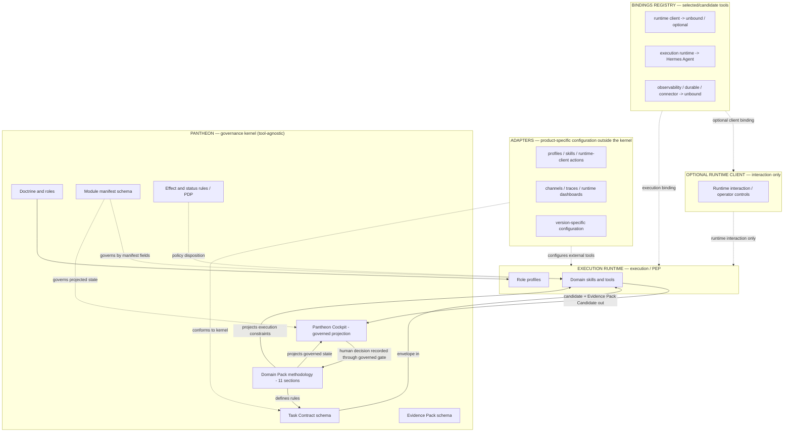

# Modular Domain Reorientation

Status: active support doctrine — tool-agnostic placement, modular capability contract and domain-pack projection model.

This document is a coordination artifact. It captures a reorientation so that parallel work — including ChatGPT-assisted development — stays aligned on one model.

It does not implement a runtime, a bridge, a plugin manager, a skill installer, a module registry runtime, a domain-pack worker, a runtime-client component, a Hermes skill, an executable schema or any automatic approval or memory promotion.

Runtime/client/authority placement is inherited from `HERMES_INTEGRATION.md`: optional compatible runtime clients expose runtime interaction, Hermes Agent is the selected external execution runtime and PEP, Pantheon Cockpit projects governed professional state, and Pantheon policy/governance remains the PDP authority.

```text
This document governs placement orientation and cross-layer projection.
It does not replace MODULE_ACTIVATION.md, DOMAIN_PACK_SPEC.md, CAPABILITY_PLACEMENT.md or TASK_CONTRACTS.md.
It reconciles them under a single modular and domain placement model.
```

## Purpose

Pantheon Next is a method and governance framework, not a product runtime.

The deliverable is the set of rules, contracts, schemas and roles. It must survive the replacement of any single tool.

This reorientation answers three practical questions raised during review:

```text
What is interchangeable, and what is not?
Where does each capability live?
Where does a profession's methodology live?
```

## Reorientation summary

1. The framework body stays tool-agnostic. Product names belong only in explicit binding, adapter, integration or reference contexts.
2. Pantheon is not a funnel everything passes through. It attaches only at consequential decision points.
3. The non-negotiable prohibitions constrain the Pantheon repository, not the whole system. The execution runtime may be a runtime. A runtime client may host runtime-interaction plugins. Pantheon Cockpit remains governed projection rather than a runtime host.
4. New capability is added by declaration, not by hardcoding. A conformant manifest plus the shared envelope makes a module drop in and stay governed.
5. A profession's methodology is defined once in Pantheon and projected into governed Cockpit surfaces and execution-side adapters. The rule never lives inside a replaceable tool.
6. Pantheon has a stable governance kernel and replaceable adapters. Tool releases are adapter events unless they reveal a missing tool-agnostic governance distinction.

## Doctrine, abstract form

```text
The runtime client exposes interaction when one is selected.
The execution runtime executes.
The governed projection surface shows Pantheon state.
Pantheon governs.
```

## Kernel and adapter split

Pantheon is divided conceptually into two layers:

```text
Governance kernel -> tool-agnostic rules that define legitimacy, truth status,
                     evidence, approval, memory, scope, action boundaries and
                     capability placement.

Adapters          -> tool-specific runtime interaction, bindings, prompts, profiles,
                     skills, channels, dashboards, traces and runtime settings.
```

Pantheon Cockpit is a governed projection of kernel-owned state. It does not become a second runtime-client adapter.

The kernel is allowed to evolve during controlled bootstrap, because deployment has not stabilized yet. But a kernel change must satisfy a stricter test than an adapter update.

A rule belongs in the kernel only when it can be stated without naming a product and when it remains true if the runtime client, execution runtime, observability layer, connector gateway or graph layer changes.

Examples of kernel rules:

```text
answering is not acting;
runtime success is not approval;
transport success is not task success;
retrieval is not proof;
trace is not Evidence Pack;
runtime memory is not canonical memory;
profile identity is not Pantheon Role authority;
plugin installed is not capability approved;
asynchronous execution does not change output status;
scheduled execution does not bypass scope, evidence or approval;
channel proximity does not imply approval;
projection is not persistence.
```

Examples of adapter or projection rules:

```text
which Hermes profile is selected;
which runtime-client control exposes a runtime interaction;
which Pantheon Cockpit card projects a governed gate;
which Langfuse metadata field carries a trace reference;
which messaging channel receives a draft;
which runtime feature performs background execution;
which skill implements extraction or image editing.
```

Tool-specific power is welcome. It must be expressed through adapters that depend on the kernel, not by embedding product behavior inside the kernel.

### Kernel-change test

Before changing the kernel, ask:

```text
Would this rule still be necessary if every current tool were replaced?
```

- Yes — it may be a kernel rule.
- No — it belongs in a binding, adapter, profile, skill, integration note or reference review.

During bootstrap, kernel changes are acceptable when they clarify durable governance. After deployment stabilization, the same changes should be treated as doctrine revisions requiring stricter review.

### Bindings registry

This registry records selected or candidate product bindings without turning optional surfaces into requirements.

| Abstract role | Current binding | Status |
|---|---|---|
| runtime interaction client | unbound | optional / no client selected |
| execution runtime | Hermes Agent | selected external runtime |
| governed projection | Pantheon Cockpit | active Pantheon projection owner |
| observability | unbound | candidate — add only on real need |
| durable executor | unbound | candidate |
| deterministic preparation | script / skill | default pattern |
| connector gateway | unbound | candidate |
| provenance graph | unbound | candidate |

Outside explicit binding/adapter/integration/reference contexts, the framework body uses abstract role names only.

Exception — bindings and adapters documents. Dedicated integration and adapter documents may name products because their subject is the binding to a specific tool. This exception covers the bindings registry above, `ADAPTERS_AND_BINDINGS.md`, `HERMES_INTEGRATION.md`, tool-specific integration documents and `reference_reviews/`. Everywhere else, generic doctrine stays abstract.

```text
client available != client selected
client selected != authority transfer
projection != persistence
```

## Placement model

Pantheon attaches only to consequential decisions. Most capabilities do not require Pantheon to execute them.

| The capability concerns | Built/projected in | Pantheon involved |
|---|---|---|
| runtime chat / run interaction / operator controls | optional runtime client | no, unless a consequential decision is requested |
| governed Cards / Evidence gaps / approval and decision state | Pantheon Cockpit | yes as governed projection; projection itself has no execution authority |
| do / execute / compute / extract / call | execution runtime | no, unless external effect or governed consequence requires PDP/PEP policy |
| decide / validate / persist / authorize | Pantheon governance/policy | yes — governance only, not execution |

### Placement test

For every module, ask:

```text
If this goes wrong, does it produce a false truth, an unapproved external effect,
a wrong memory, or an unauthorized action?
```

- No — it is a feature. Build it where the tool is strong. Do not involve Pantheon unnecessarily.
- Yes — Pantheon policy/governance decides the applicable legitimacy boundary. The execution still lives in the external runtime/PEP.

Governing a capability is not the same as implementing it in Pantheon.

## Modular capability contract

A new module is never known in advance. It declares itself through a manifest and speaks the envelope. It then drops in, works, and stays governed automatically where the declared consequence fields require governance.

### Modularity rules

```text
1. Discovery, not hardcoding: detected -> enabled -> task_authorized.
2. Modules never gain authority by calling one another; cross-boundary exchange uses the envelope.
3. Governance attaches by manifest fields and applicable policy, not by UI location.
4. Graceful degradation: a missing dependency makes a module visibly unavailable, never a silent break.
5. Adapter conformance, not kernel duplication: modules reference Pantheon rules; they do not redefine them.
```

### Envelope

The single shape of cross-boundary exchange:

```text
Task Contract (in) -> module -> { Result Candidate, Evidence Pack Candidate } (out)
```

The envelope is a kernel rule. The transport, profile, skill, connector, subagent, workflow engine, runtime client or messaging channel used to carry it is adapter/runtime territory.

### Module manifest, complete shape

Specification only. The canonical executable schema, if created, lives under `schemas/` and requires explicit approval before being added.

```text
module_manifest:
  id:                  # stable identifier
  name:
  version:
  owner_layer:         # runtime_client | execution_runtime | pantheon
  type:                # skill | tool | function | pipe | filter | action | flow | profile
  description:
  status:              # documentary lifecycle: candidate | active_support | active_doctrine | deprecated | rejected
  activation:
    state:             # governed activation state — see MODULE_ACTIVATION.md vocabulary (unavailable, detected, disabled, watch, candidate, sandbox_enabled, project_enabled, dossier_enabled, domain_enabled, organization_enabled, suspended, deprecated, rejected)
    scope:             # session | task | dossier | project | domain | user | organization | system
  task_authorization:
    state:             # unauthorized | task_authorized
  interface:
    allowed_inputs:    # accepted input types
    allowed_outputs:   # produced output types
    forbidden_outputs: # must never be produced
    envelope:          # task_contract_in / candidate_out / evidence_pack_out
  governance:
    consequential:     # true if it touches truth / external effect / memory / authorization
    risk_level:        # low | medium | high | critical
    approval_behavior: # C-level required for its consequential effects (C0-C5)
    memory_behavior:   # none | candidate_only | never_canonical
    scope_behavior:    # allowed scope / isolation
  dependencies:
    requires:          # must be present and enabled
    optional:          # improves if present, degrades gracefully otherwise
  composition:
    talks_only_via_envelope: true
  provenance:
    source:
    author:
    reviewed_by:
```

Status, activation and task authorization are three different axes. The activation vocabulary is owned by `MODULE_ACTIVATION.md`; the manifest references it, it does not restate it.

Pantheon's contribution to modularity is to define the manifest and the envelope. It is not a plugin runtime. Module loading lives in the execution runtime or optional runtime client where appropriate. Pantheon Cockpit only projects governed module state and decision surfaces.

## Version-change discipline

A tool version change may expose new capability, new convenience or new risk.

Pantheon handles it through a two-step rule:

```text
1. Classify the new surface against the kernel.
2. Adapt the binding or adapter unless the kernel cannot classify it.
```

The default is:

```text
new tool feature -> adapter review
new abstract consequence -> possible kernel revision
```

A version update never authorizes a capability by itself. It only creates a review event.

Required classification:

```text
version_change_review:
  tool_or_layer:
  version_or_change_ref:
  changed_surface:
  new_runtime_power:
  new_external_effect:
  new_memory_behavior:
  new_profile_or_identity_behavior:
  existing_kernel_rule:
  adapter_change_required:
  kernel_change_required: false by default
  decision: accepted | refused | to_verify | to_arbitrate
```

## Domain pack projection model

A profession's value is not the generic governance core. It is the domain methodology. That methodology is defined once in Pantheon and projected outward without handing authority to a replaceable tool.

```text
The profession is defined in Pantheon.
Pantheon Cockpit projects governed professional state.
The execution runtime applies execution-side prompts, skills and tools.
An optional runtime client exposes runtime interaction only.
One source, multiple projections, never a rule inside a replaceable tool.
```

A domain pack is a governed methodology configuration, not an executable runtime module. It carries a descriptor for indexing and activation scope, but not the execution fields of a capability manifest (no allowed_inputs/outputs, no envelope). It parameterizes the workflows and skills that produce candidates; it does not produce candidates itself.

### Where each domain-pack section lands

| Domain pack section | Rule (source) | Executes via | Governed projection via |
|---|---|---|---|
| 1. Scope and audience | Pantheon | — | Pantheon Cockpit (read-only) |
| 2. Vocabulary | Pantheon | execution runtime role prompts | Pantheon Cockpit labels |
| 3. Source policy | Pantheon | execution runtime source-audit skill | Pantheon Cockpit source status when relevant |
| 4. Evidence expectations | Pantheon | execution runtime produces Evidence Pack Candidate | Pantheon Cockpit displays Evidence gaps/status |
| 5. Risk triggers | Pantheon | roles / execution runtime check | Pantheon Cockpit warning / gate |
| 6. Pre-transmission minimization | Pantheon | execution runtime prep masks | Pantheon Cockpit shows governed minimization state |
| 7. Output statuses and delivery gates | Pantheon | — | Pantheon Cockpit status + approval surface |
| 8. Answering / acting boundary | Pantheon | execution runtime refuses out of bounds | Pantheon Cockpit human gate |
| 9. Memory rules | Pantheon | execution runtime proposes candidates | Pantheon Cockpit review |
| 10. Review angles and decision gates | Pantheon | execution runtime role prompts | Pantheon Cockpit shows the gate |
| 11. Templates | shape in Pantheon | execution template if needed | Pantheon Cockpit render where governed projection is needed |

All eleven rules live in Pantheon. No rule is defined inside a runtime client or execution tool; it is only applied or projected there.

The duplication risk: the same domain knowledge copied into the Pantheon pack, a Cockpit template, a runtime-client surface and an execution-runtime skill prompt will drift. Discipline: Pantheon is the single source; projections/adapters reference the pack, they do not restate it.

## Diagram



## Coordination note for parallel development

```text
Single source of truth for the manifest and envelope: this document, until a
schemas/ file is approved.
The framework body stays tool-agnostic. Product names belong only in explicit binding, adapter, integration or reference contexts.
Build execution in Hermes and runtime interaction in a compatible client only if one is selected.
Project governed Cards, Evidence gaps and decision state through Pantheon Cockpit.
Route consequential effects through the Pantheon PDP -> external PEP boundary.
Build one domain pack deeply (architecture first) before generalizing to other professions.
A domain pack's methodology comes from the professional, structured by the framework, never invented.
During bootstrap, improve the kernel when a durable governance invariant is missing.
After bootstrap, treat kernel changes as stricter doctrine revisions.
```

Files that may be edited without confirmation remain governance Markdown, templates, examples and AI logs. Anything under `schemas/`, `tests/`, `operations/`, `platform/`, Docker, `.env` and `CLAUDE.md` requires explicit approval first.

## Boundary phrase

```text
Pantheon defines the kernel and policy.
Adapters express replaceable tools.
Hermes carries external execution.
Optional clients expose runtime interaction.
Pantheon Cockpit projects governed state.
The validated remains.
```
