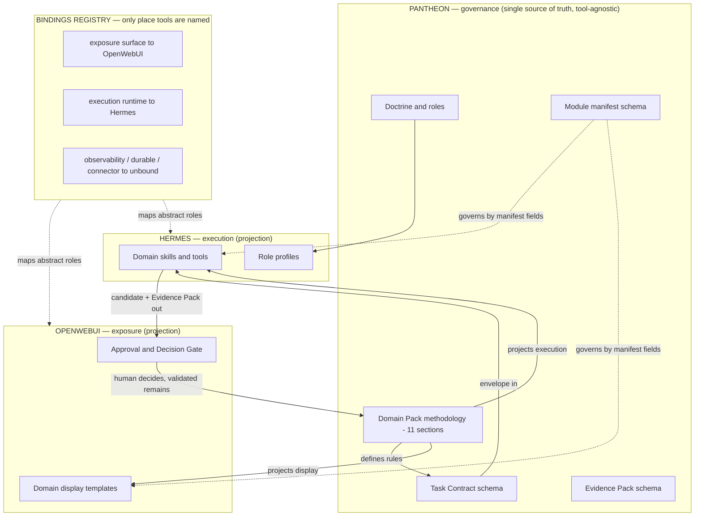

# Modular Domain Reorientation

Status: active support doctrine — tool-agnostic placement, modular capability contract and domain-pack projection model.

This document is a coordination artifact. It captures a reorientation so that parallel work — including ChatGPT-assisted development — stays aligned on one model.

It does not implement a runtime, a bridge, a plugin manager, a skill installer, a module registry runtime, a domain-pack worker, an OpenWebUI Function, a Hermes skill, an executable schema or any automatic approval or memory promotion.

```text
OpenWebUI exposes.
Hermes Agent executes.
Pantheon Next governs.
```

## Purpose

Pantheon Next is a method and governance framework, not a product runtime.

The deliverable is the set of rules, contracts, schemas and roles. It must survive the replacement of any single tool.

This reorientation answers three practical questions raised during review:

```text
What is interchangeable, and what is not?
Where does each capability live?
Where does a profession's methodology live?
```

## Reorientation summary

1. The framework body stays tool-agnostic. Product names live in one place only: the bindings registry.
2. Pantheon is not a funnel everything passes through. It attaches only at consequential decision points.
3. The non-negotiable prohibitions constrain the Pantheon repository, not the whole system. Hermes may be a runtime. OpenWebUI may host plugins.
4. New capability is added by declaration, not by hardcoding. A conformant manifest plus the shared envelope makes a module drop in and stay governed.
5. A profession's methodology is defined once in Pantheon and projected into tool-specific surfaces. The rule never lives inside a tool.

## Doctrine, abstract form

```text
The exposure surface exposes.
The execution runtime executes.
Pantheon governs.
```

### Bindings registry

The only place where products are named. Changing a tool is a one-line change here, with no rewrite of the framework body.

| Abstract role | Current binding | Status |
|---|---|---|
| exposure surface | OpenWebUI | active |
| execution runtime | Hermes | active |
| observability | unbound | candidate — add only on real need |
| durable executor | unbound | candidate |
| deterministic preparation | script / skill | default |
| connector gateway | unbound | candidate |
| provenance graph | unbound | candidate |

## Placement model

Pantheon attaches only to consequential decisions. Most modules never touch it.

| The capability concerns | Built in | Pantheon involved |
|---|---|---|
| show / capture / interact / organize dossiers | OpenWebUI | no, unless it captures a decision |
| do / execute / compute / extract / call | Hermes | no, unless external effect or truth |
| decide / validate / persist / authorize | Pantheon (rule) | yes — its only job |

### Placement test

For every module, ask:

```text
If this goes wrong, does it produce a false truth, an unapproved external effect,
a wrong memory, or an unauthorized action?
```

- No — it is a feature. Build it where the tool is strong. Do not involve Pantheon.
- Yes — the decision passes through Pantheon. The execution still lives in Hermes.

Governing a capability is not the same as implementing it in Pantheon.

## Modular capability contract

A new module is never known in advance. It declares itself through a manifest and speaks the envelope. It then drops in, works, and stays governed automatically.

### Modularity rules

```text
1. Discovery, not hardcoding: detected -> enabled -> task_authorized.
2. Modules never call each other directly; everything passes through the envelope.
3. Governance attaches by manifest fields, automatically.
4. Graceful degradation: a missing dependency makes a module visibly unavailable, never a silent break.
```

### Envelope

The single shape of cross-boundary exchange:

```text
Task Contract (in) -> module -> { Result Candidate, Evidence Pack Candidate } (out)
```

### Module manifest, complete shape

Specification only. The canonical executable schema, if created, lives under `schemas/` and requires explicit approval before being added.

```text
module_manifest:
  id:                  # stable identifier
  name:
  version:
  owner_layer:         # openwebui | hermes | pantheon
  type:                # skill | tool | function | pipe | filter | action | flow | profile
  description:
  status:              # detected | enabled | task_authorized | suspended | rejected
  interface:
    allowed_inputs:    # accepted input types
    allowed_outputs:   # produced output types
    forbidden_outputs: # must never be produced
    envelope:          # task_contract_in / candidate_out / evidence_pack_out
  governance:
    consequential:     # true if it touches truth / external effect / memory / authorization
    risk_level:        # low | medium | high | critical
    approval_behavior: # C-level required for its consequential effects (C0-C5)
    memory_behavior:   # none | candidate_only | never_canonical
    scope_behavior:    # allowed scope / isolation
  dependencies:
    requires:          # must be present and enabled
    optional:          # improves if present, degrades gracefully otherwise
  composition:
    talks_only_via_envelope: true
  provenance:
    source:
    author:
    reviewed_by:
```

Pantheon's contribution to modularity is to define the manifest and the envelope. It is not a plugin runtime. Module loading lives in Hermes (skills) and OpenWebUI (Functions, Tools, Pipes, Filters, Actions).

## Domain pack projection model

A profession's value is not the generic governance core. It is the domain methodology. That methodology is defined once in Pantheon and projected outward.

```text
The profession is defined in Pantheon, displayed via OpenWebUI, executed via Hermes.
One source, two projections, never a rule inside a tool.
```

A domain pack is itself a module. It declares a manifest. Its `dependencies` list the display templates and skills it projects to.

### Where each domain-pack section lands

| Domain pack section | Rule (source) | Executes via | Displays / captures via |
|---|---|---|---|
| 1. Scope and audience | Pantheon | — | OpenWebUI (read-only) |
| 2. Vocabulary | Pantheon | Hermes role prompts | OpenWebUI labels |
| 3. Source policy | Pantheon | Hermes source-audit skill | — |
| 4. Evidence expectations | Pantheon | Hermes produces Evidence Pack to shape | OpenWebUI displays |
| 5. Risk triggers | Pantheon | roles / Hermes check | OpenWebUI warning / gate |
| 6. Pre-transmission minimization | Pantheon | Hermes prep masks | OpenWebUI shows what is masked |
| 7. Output statuses and delivery gates | Pantheon | — | OpenWebUI status + approval prompt |
| 8. Answering / acting boundary | Pantheon | Hermes refuses out of bounds | OpenWebUI human gate |
| 9. Memory rules | Pantheon | Hermes proposes candidates | OpenWebUI review |
| 10. Review angles and decision gates | Pantheon | Hermes role prompts | OpenWebUI shows the gate |
| 11. Templates | shape in Pantheon | execution template if needed | OpenWebUI render |

All eleven rules live in Pantheon. No rule is defined inside a tool; it is only applied there.

The duplication risk: the same domain knowledge copied into the Pantheon pack, the OpenWebUI template and the Hermes skill prompt will drift. Discipline: Pantheon is the single source; templates reference the pack, they do not restate it.

## Diagram



## Coordination note for parallel development

```text
Single source of truth for the manifest and envelope: this document, until a
schemas/ file is approved.
The framework body stays tool-agnostic. Product names go only in the bindings registry.
Build freely in OpenWebUI and Hermes. Route only consequential decisions through Pantheon.
Build one domain pack deeply (architecture first) before generalizing to other professions.
A domain pack's methodology comes from the professional, structured by the framework, never invented.
```

Files that may be edited without confirmation remain governance Markdown, templates, examples and AI logs. Anything under `schemas/`, `tests/`, `operations/`, `platform/`, Docker, `.env` and `CLAUDE.md` requires explicit approval first.

## Boundary phrase

```text
Pantheon defines the contract.
The tools carry the work.
The validated remains.
```
